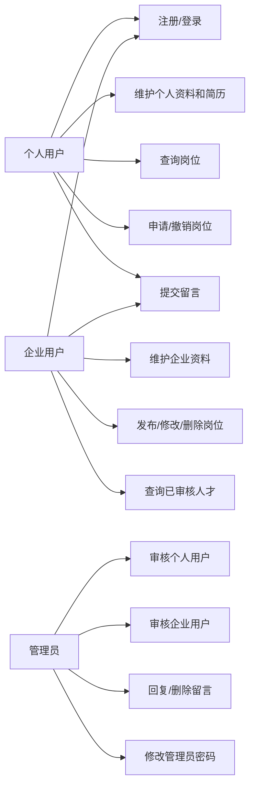
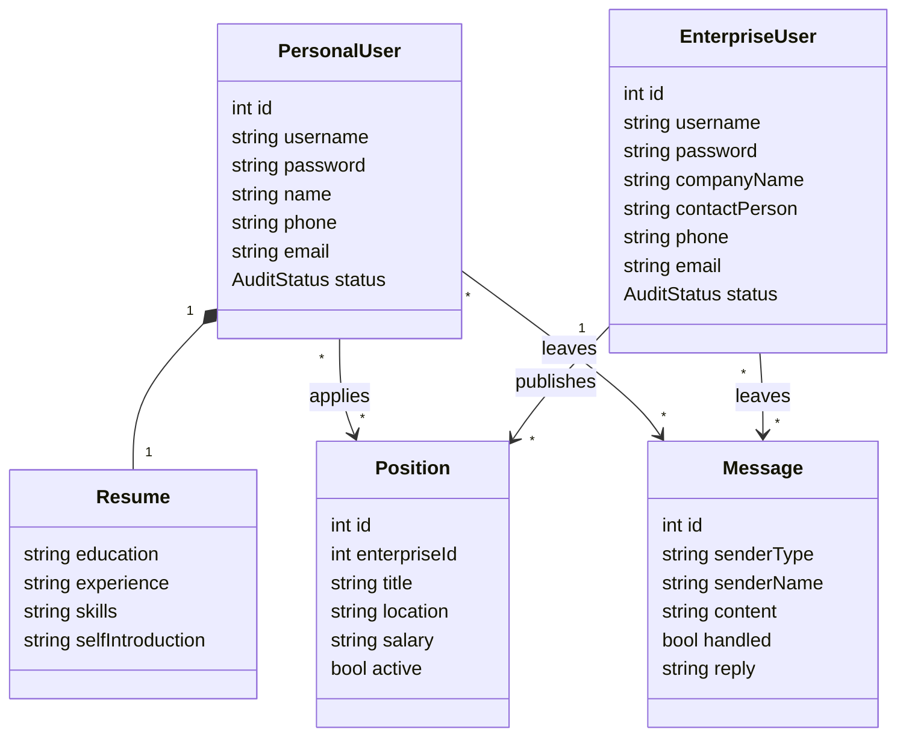
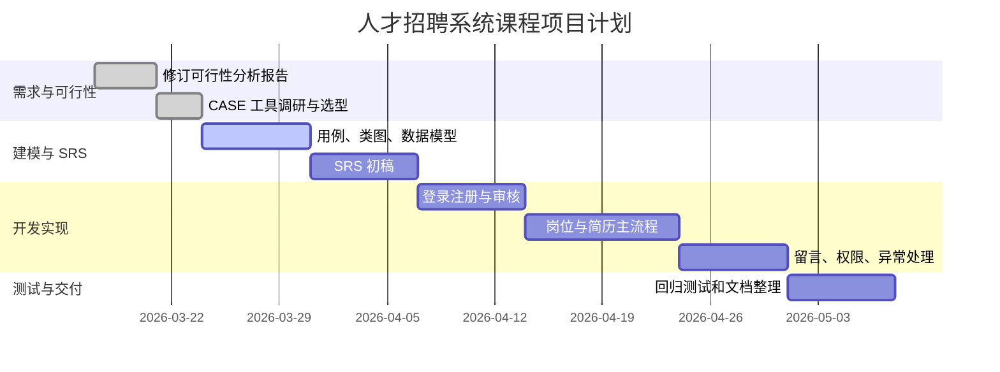

# 实验二：持续沟通修订可行性分析报告、CASE 调研

## 1. 实验目的与完成情况

### 1.1 实验目的

1. 持续进行项目沟通、调查，修订上一阶段的可行性分析报告。
2. 调研 CASE（Computer-Aided Software Engineering，计算机辅助软件工程）工具，并结合项目特点选择合适工具。
3. 将项目工作文档、进度文档保存到协作开发平台，便于持续跟踪。

### 1.2 本次完成内容

本次实验以“人才招聘系统”为项目对象，结合现有代码基础和课程项目目标，对可行性分析报告进行了修订，并完成了主流 CASE 工具调研、工具选型和初步应用。

当前项目已有基础包括：

1. 使用 `C++ + Qt Widgets` 实现桌面端图形界面。
2. 已有登录窗口、个人用户注册、企业用户注册和三类角色主界面。
3. 已抽象 `RecruitmentService` 业务服务层。
4. 已支持本地 `recruitment_data.txt` 数据读写。
5. 已包含个人用户、企业用户、管理员三类角色及岗位、简历、留言、审核等核心数据结构。

## 2. 持续沟通后的项目范围修订

### 2.1 原始目标

项目最初目标是实现一个面向个人用户、企业用户和管理员的人才招聘系统，提供注册登录、简历维护、岗位发布、岗位申请、人才查询、会员审核和留言处理等功能。

### 2.2 沟通后确认的核心需求

结合现有原型、开发周期和课程验收要求，本阶段将系统范围收敛为“轻量级桌面招聘管理系统”，优先保证核心业务链路可运行。

| 用户角色 | 核心需求 | 当前处理策略 |
|---|---|---|
| 个人用户 | 注册登录、维护个人资料和简历、查询岗位、申请岗位、撤销申请、留言 | 作为第一优先级，确保求职主流程完整。 |
| 企业用户 | 注册登录、维护企业资料、发布和管理岗位、查询已审核人才、留言 | 作为第一优先级，保证招聘方能发布岗位并筛选人才。 |
| 管理员 | 审核个人会员、审核企业会员、回复或删除留言、修改密码 | 作为权限控制和平台管理的核心功能。 |
| 系统维护者 | 数据保存、构建运行、文档和进度跟踪 | 使用 Git/GitHub 管理代码和实验文档。 |

### 2.3 本次需求调整

1. 当前版本以桌面端本地运行作为主要交付形态，不扩展 Web 服务端。
2. 数据持久化继续使用结构化文本文件，后续若有时间再升级到 SQLite。
3. 用户权限先通过角色入口和服务层校验控制，不引入复杂 RBAC 模型。
4. 搜索、审核、留言和岗位管理作为验收重点，推荐匹配、在线投递通知等功能作为扩展项。
5. 文档统一放入仓库中的 `software_engineering_experiments/`，不再使用被忽略的 `deliverables/` 作为协作交付目录。

## 3. 可行性分析报告修订版

### 3.1 项目概述

人才招聘系统用于解决求职者、企业和平台管理员之间的信息管理问题。系统以岗位信息和人才简历为核心数据，围绕“用户注册审核、岗位发布查询、岗位申请、人才查询、留言反馈”形成业务闭环。

项目性质属于课程设计和小型原型系统，目标不是构建面向公网的大型招聘平台，而是在有限周期内完成一个结构清晰、业务完整、可演示、可维护的桌面端系统。

### 3.2 业务可行性

招聘管理是典型的信息管理场景，角色边界清晰，业务流程稳定，适合作为软件工程课程项目。

主要业务流程如下：

1. 个人用户注册，等待管理员审核。
2. 企业用户注册，等待管理员审核。
3. 管理员审核用户，通过后用户进入主业务流程。
4. 企业发布岗位，个人用户查询岗位并申请。
5. 企业查询已审核人才，用于筛选候选人。
6. 用户通过留言反馈问题，管理员统一处理。

该流程覆盖了需求分析、角色建模、数据建模、权限控制、界面设计、业务服务封装和测试验证等软件工程知识点，业务可行性较高。

### 3.3 技术可行性

项目采用 `C++ + Qt Widgets`，技术路线与已有代码一致。

| 技术点 | 当前状态 | 可行性判断 |
|---|---|---|
| 桌面 GUI | 已有登录窗口和角色主界面 | Qt Widgets 成熟稳定，适合表单和表格类管理系统。 |
| 业务服务层 | 已有 `RecruitmentService` | 可继续封装注册、登录、审核、岗位、留言等逻辑。 |
| 数据持久化 | 使用本地文本文件 | 对课程原型足够，后续可迁移 SQLite。 |
| 构建运行 | 已有批处理构建脚本 | 本地 Windows + Qt + MinGW 环境已能支撑开发。 |
| 版本管理 | 已连接 GitHub 仓库 | 适合保存代码、实验文档和进度记录。 |

主要技术风险是文本文件存储的可靠性、明文密码安全、界面逻辑复杂度和异常输入处理。由于项目规模较小，这些风险可通过输入校验、服务层集中处理、阶段性测试和后续数据库升级缓解。

### 3.4 经济可行性

项目主要使用免费或已有工具：

1. Qt Community、MinGW、VS Code 可免费使用。
2. Git 和 GitHub 可满足课程级版本管理需求。
3. StarUML、PlantUML、GanttProject、GitHub Projects 均可用于学习和轻量协作。
4. 项目运行不依赖额外服务器、域名或云资源。

因此经济成本主要是开发时间成本，硬件和软件成本较低，经济上可行。

### 3.5 操作可行性

系统采用桌面图形界面，面向三类用户分别提供不同工作区，适合非技术用户操作。

| 角色 | 操作特点 | 可行性 |
|---|---|---|
| 个人用户 | 填写资料、查询岗位、申请岗位 | 表单和表格即可完成，学习成本低。 |
| 企业用户 | 维护企业资料、管理岗位、查询人才 | 与常见管理系统一致，操作直观。 |
| 管理员 | 审核列表、留言处理 | 以表格选择和按钮操作为主，流程简单。 |

只要界面提示、异常提示和数据刷新逻辑保持一致，操作可行性较高。

### 3.6 进度可行性

项目适合采用迭代方式推进。建议按 6 周左右安排：

| 周期 | 阶段 | 主要任务 | 阶段成果 |
|---|---|---|---|
| 第 1 周 | 需求和可行性 | 明确角色、功能、风险、CASE 工具 | 可行性分析报告、工具调研 |
| 第 2 周 | 需求建模 | 用例、数据模型、活动流程 | SRS 初稿和基础模型 |
| 第 3 周 | 核心功能一 | 登录注册、资料维护、审核 | 可运行基础版本 |
| 第 4 周 | 核心功能二 | 岗位发布、查询、申请、撤销 | 招聘主流程版本 |
| 第 5 周 | 管理和完善 | 留言处理、权限、异常处理 | 可演示版本 |
| 第 6 周 | 测试和文档 | 回归测试、报告整理、答辩材料 | 最终代码和文档 |

在控制扩展需求的前提下，进度可行。

### 3.7 法律与合规可行性

招聘系统会涉及姓名、电话、邮箱、简历经历、企业信息等数据。课程项目阶段虽然不面向真实公网用户，但仍需要体现基本合规意识：

1. 不采集与招聘无关的敏感信息。
2. 限制不同角色访问范围，避免越权查看数据。
3. 密码不宜长期明文保存，后续应改为哈希存储。
4. 文档和演示数据应使用模拟数据，避免真实个人信息。
5. 若未来上线，应补充隐私政策、数据删除和访问控制机制。

### 3.8 风险分析与应对

| 编号 | 风险 | 概率 | 影响 | 等级 | 应对措施 |
|---|---|---:|---:|---|---|
| R1 | 需求范围持续扩大 | 中 | 高 | 高 | 将功能分为核心功能和扩展功能，优先保证主流程。 |
| R2 | 文本文件存储出错 | 中 | 中 | 中 | 增加保存失败提示、备份样例数据，后续迁移 SQLite。 |
| R3 | 明文密码和个人信息安全不足 | 中 | 高 | 高 | 文档中明确风险，后续实现密码哈希和访问控制。 |
| R4 | Qt 界面事件逻辑复杂 | 中 | 中 | 中 | 保持界面层只负责交互，业务规则放入服务层。 |
| R5 | 文档与代码不同步 | 中 | 中 | 中 | 每个实验结束更新对应文档和跟踪表。 |
| R6 | 构建环境依赖本机配置 | 低 | 中 | 中 | 保留构建脚本和环境说明。 |
| R7 | 测试不足导致演示失败 | 中 | 高 | 高 | 建立登录、注册、审核、岗位申请等回归测试清单。 |

### 3.9 修订结论

修订后项目定位更加明确：以本地桌面端人才招聘系统为主线，使用现有 `C++ + Qt Widgets` 原型继续迭代，优先交付完整业务闭环。项目在业务、技术、经济、操作和进度方面均具备可行性；主要风险集中在需求范围、数据可靠性、安全性和测试充分性上，但可通过迭代管理、工具支持和阶段性审阅进行控制。

## 4. CASE 工具调研

### 4.1 CASE 工具分类

CASE 工具可以按软件生命周期支持范围分为三类：

1. 上游 CASE：需求分析、业务建模、UML/ER/DFD 建模、原型设计。
2. 下游 CASE：编码辅助、测试、配置管理、持续集成、缺陷跟踪。
3. 集成 CASE：贯穿需求、设计、开发、测试和项目管理全过程。

本项目重点需要以下能力：

1. 建模：用例图、类图、活动图、ER 图、数据流图。
2. 进度：甘特图、里程碑、任务分解、关键路径。
3. 协作：版本管理、任务看板、Issue 和文档沉淀。
4. 测试：后续可做接口或流程测试记录。

### 4.2 主流工具调研表

| 工具 | 类型 | 主要用途 | 技术特点 | 优点 | 局限 | 本项目适配度 |
|---|---|---|---|---|---|---|
| Microsoft Visio | 建模/绘图 | 流程图、UML、网络图、组织结构图 | 通用绘图能力强，模板多 | 上手快，图形规范 | 商业软件，版本协作依赖 Office 生态 | 中 |
| Microsoft Project | 项目管理 | 甘特图、资源、工期、依赖 | 计划管理能力强 | 适合正式项目进度管理 | 成本较高，对课程项目偏重 | 中 |
| Azure DevOps/TFS | 集成 CASE | 代码、任务、测试、流水线 | 与微软开发生态集成 | ALM 能力完整 | 配置较重 | 中 |
| Visual SourceSafe | 配置管理 | 早期版本控制 | 集中式版本管理 | 历史工具，教材常见 | 已落后于 Git 工作流 | 低 |
| SmartDraw | 绘图/建模 | 流程图、组织结构、软件图 | 模板丰富 | 快速出图 | 工程语义和版本协作较弱 | 中 |
| MagicDraw/Cameo | 专业建模 | UML、SysML、架构建模 | 建模能力强，适合复杂系统 | 规范性高 | 商业成本和学习成本高 | 中 |
| Rational Rose | UML 建模 | 面向对象分析设计 | 经典 UML 工具 | 教材案例多 | 较老，现代协作体验弱 | 中低 |
| PowerDesigner | 数据建模 | 数据库、ER 模型、企业架构 | 数据模型能力强 | 适合数据库设计 | 对本项目当前文本存储偏重 | 中 |
| Enterprise Architect | 集成建模 | UML、需求、架构、追踪 | 生命周期覆盖广 | 适合大型正式项目 | 学习成本高 | 中 |
| StarUML | 轻量建模 | UML、ERD、DFD、SysML | 跨平台，支持 UML 2.x 和导出文档 | 适合小团队和教学 | 项目管理能力弱 | 高 |
| PlantUML | 文本化建模 | UML、活动图、时序图等 | 图即代码，便于 Git 管理 | 轻量、可版本化 | 需要掌握语法，复杂布局不如专业绘图工具 | 高 |
| Visual Paradigm | 综合建模/敏捷 | UML、BPMN、ERD、Scrum、项目管理 | 功能完整，一体化程度高 | 适合报告和模型管理 | 完整功能商业化较强 | 高 |
| Git | 配置管理 | 代码和文档版本控制 | 分布式版本控制 | 行业主流，可追踪变更 | 本身不提供图形化项目管理 | 高 |
| GitHub Projects | 协作/项目管理 | Issue、看板、路线图、字段、图表 | 与仓库、Issue、PR 集成 | 适合轻量协作和课程仓库 | UML 建模能力弱 | 高 |
| Apache JMeter | 测试 | 性能测试、接口测试 | 支持压测和脚本化测试 | 适合 Web/API 系统 | 当前桌面项目使用场景有限 | 低 |

### 4.3 工具选型原则

本项目是课程级小型桌面系统，工具选型不宜过重。选择标准如下：

1. 能支撑课程要求中的建模、进度跟踪和协作。
2. 学习成本低，能快速产生报告和图表。
3. 与 GitHub 仓库结合方便。
4. 不引入高昂商业成本。
5. 产物便于提交、审阅和版本追踪。

### 4.4 推荐工具组合

本项目推荐采用：

`StarUML + PlantUML/Mermaid + GanttProject + GitHub Projects + Git`

| 工具 | 用途 | 选择理由 |
|---|---|---|
| StarUML | 用例图、类图、ER 图、DFD | 支持 UML 2.x、ERD、DFD，适合课程建模和小团队。 |
| PlantUML/Mermaid | 文本化图表和仓库内文档图 | 可以直接写入 Markdown，便于 Git 追踪和审阅。 |
| GanttProject | 甘特图、任务依赖、里程碑 | 适合进度计划和阶段成果展示。 |
| GitHub Projects | Backlog、任务看板、状态跟踪 | 与当前 GitHub 仓库直接关联，适合持续更新。 |
| Git | 代码和文档版本管理 | 保证每次实验成果可追溯。 |

## 5. CASE 工具初步应用

### 5.1 需求用例模型

### 5.2 初步数据模型

### 5.3 初步进度甘特图

### 5.4 GitHub Projects 字段建议

| 字段 | 类型 | 示例 |
|---|---|---|
| Status | 单选 | Todo / In Progress / Review / Done |
| Priority | 单选 | High / Medium / Low |
| Type | 单选 | Requirement / Design / Code / Test / Document |
| Sprint | 迭代 | Sprint 0 / Sprint 1 / Sprint 2 |
| Estimate | 数字 | 1、2、3、5 人时 |
| Owner | 文本 | 需求、设计、开发、测试、文档 |

### 5.5 初始 Backlog

| 编号 | 条目 | 类型 | 优先级 | 验收标准 |
|---|---|---|---|---|
| B01 | 个人用户注册和登录 | Code | High | 能注册、登录，重复用户名被拒绝。 |
| B02 | 企业用户注册和登录 | Code | High | 能注册、登录，审核前受限。 |
| B03 | 管理员审核个人和企业 | Code | High | 管理员能通过或拒绝待审核用户。 |
| B04 | 个人简历维护 | Code | High | 个人用户能编辑并保存简历信息。 |
| B05 | 企业岗位管理 | Code | High | 企业能新增、修改、下架岗位。 |
| B06 | 岗位查询和申请 | Code | High | 个人用户能查询可见岗位并申请、撤销。 |
| B07 | 人才查询 | Code | Medium | 企业能查看已审核人才列表。 |
| B08 | 留言处理 | Code | Medium | 用户能留言，管理员能回复和删除。 |
| B09 | 文档和模型同步 | Document | Medium | 每次实验完成后更新对应文档。 |
| B10 | 回归测试清单 | Test | Medium | 覆盖登录、注册、审核、岗位和留言流程。 |

## 6. 小组协作平台保存方案

本项目使用 GitHub 仓库作为协作开发平台。保存策略如下：

1. 代码保存在 `qt_gui/`。
2. 实验文档保存在 `software_engineering_experiments/`。
3. 每个实验使用单独目录，如 `experiment_02/`。
4. 每次实验先完成本地文档并交给审阅，确认后再提交和推送。
5. 项目跟踪表持续维护，后续可迁移到 GitHub Projects。

## 7. 本次实验结论

通过本次实验，项目范围从宽泛的招聘平台收敛为可在课程周期内完成的桌面端人才招聘系统。修订后的可行性分析表明，项目在业务、技术、经济、操作和进度方面均可行。CASE 工具方面，推荐使用轻量组合：`StarUML + PlantUML/Mermaid + GanttProject + GitHub Projects + Git`，既能满足建模、进度管理和协作要求，又不会引入过重的工具成本。

后续实验应在本次成果基础上继续完善 SRS、静态/动态模型、项目跟踪表和体系结构设计文档。

## 8. 参考资料

1. GitHub Docs, About Projects: <https://docs.github.com/en/issues/planning-and-tracking-with-projects/learning-about-projects/about-projects>
2. StarUML Documentation: <https://docs.staruml.io/>
3. Visual Paradigm Features: <https://www.visual-paradigm.com/features/>
4. GanttProject Official Site: <https://www.ganttproject.biz/>
