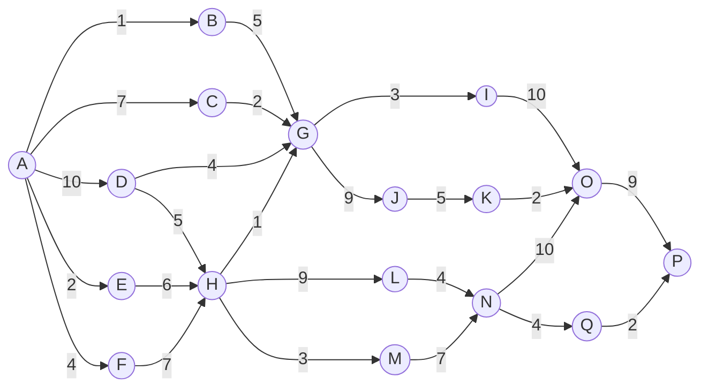

# 实验五活动图时间分析

## 1. 活动图边和工期

根据实验五文档中的活动图，活动边和工期如下：

| 活动 | 工期 |
|---|---:|
| A -> B | 1 |
| A -> C | 7 |
| A -> D | 10 |
| A -> E | 2 |
| A -> F | 4 |
| B -> G | 5 |
| C -> G | 2 |
| D -> G | 4 |
| D -> H | 5 |
| E -> H | 6 |
| F -> H | 7 |
| H -> G | 1 |
| G -> I | 3 |
| G -> J | 9 |
| J -> K | 5 |
| K -> O | 2 |
| I -> O | 10 |
| H -> L | 9 |
| L -> N | 4 |
| H -> M | 3 |
| M -> N | 7 |
| N -> O | 10 |
| N -> Q | 4 |
| Q -> P | 2 |
| O -> P | 9 |

## 2. 活动网络图

## 3. 事件最早/最晚时间

事件最早时间按正向计算，事件最晚时间按反向计算。

| 事件 | 最早时间 E | 最晚时间 L | 事件时差 |
|---|---:|---:|---:|
| A | 0 | 0 | 0 |
| B | 1 | 17 | 16 |
| C | 7 | 20 | 13 |
| D | 10 | 10 | 0 |
| E | 2 | 9 | 7 |
| F | 4 | 8 | 4 |
| G | 16 | 22 | 6 |
| H | 15 | 15 | 0 |
| I | 19 | 28 | 9 |
| J | 25 | 31 | 6 |
| K | 30 | 36 | 6 |
| L | 24 | 24 | 0 |
| M | 18 | 21 | 3 |
| N | 28 | 28 | 0 |
| O | 38 | 38 | 0 |
| P | 47 | 47 | 0 |
| Q | 32 | 45 | 13 |

项目最早完成时间为 47。

## 4. 活动最早开始、最晚开始和时差

活动最早开始时间 ES 为起点事件最早时间；活动最晚开始时间 LS 为终点事件最晚时间减去活动工期；活动时差为 `LS - ES`。

| 活动 | 工期 | ES | EF | LS | LF | 时差 | 是否关键 |
|---|---:|---:|---:|---:|---:|---:|---|
| A -> B | 1 | 0 | 1 | 16 | 17 | 16 | 否 |
| A -> C | 7 | 0 | 7 | 13 | 20 | 13 | 否 |
| A -> D | 10 | 0 | 10 | 0 | 10 | 0 | 是 |
| A -> E | 2 | 0 | 2 | 7 | 9 | 7 | 否 |
| A -> F | 4 | 0 | 4 | 4 | 8 | 4 | 否 |
| B -> G | 5 | 1 | 6 | 17 | 22 | 16 | 否 |
| C -> G | 2 | 7 | 9 | 20 | 22 | 13 | 否 |
| D -> G | 4 | 10 | 14 | 18 | 22 | 8 | 否 |
| D -> H | 5 | 10 | 15 | 10 | 15 | 0 | 是 |
| E -> H | 6 | 2 | 8 | 9 | 15 | 7 | 否 |
| F -> H | 7 | 4 | 11 | 8 | 15 | 4 | 否 |
| H -> G | 1 | 15 | 16 | 21 | 22 | 6 | 否 |
| G -> I | 3 | 16 | 19 | 25 | 28 | 9 | 否 |
| G -> J | 9 | 16 | 25 | 22 | 31 | 6 | 否 |
| J -> K | 5 | 25 | 30 | 31 | 36 | 6 | 否 |
| K -> O | 2 | 30 | 32 | 36 | 38 | 6 | 否 |
| I -> O | 10 | 19 | 29 | 28 | 38 | 9 | 否 |
| H -> L | 9 | 15 | 24 | 15 | 24 | 0 | 是 |
| L -> N | 4 | 24 | 28 | 24 | 28 | 0 | 是 |
| H -> M | 3 | 15 | 18 | 18 | 21 | 3 | 否 |
| M -> N | 7 | 18 | 25 | 21 | 28 | 3 | 否 |
| N -> O | 10 | 28 | 38 | 28 | 38 | 0 | 是 |
| N -> Q | 4 | 28 | 32 | 41 | 45 | 13 | 否 |
| Q -> P | 2 | 32 | 34 | 45 | 47 | 13 | 否 |
| O -> P | 9 | 38 | 47 | 38 | 47 | 0 | 是 |

## 5. 关键路径和总长度

时差为 0 的活动构成关键路径：

`A -> D -> H -> L -> N -> O -> P`

关键路径总长度：

`10 + 5 + 9 + 4 + 10 + 9 = 47`

因此，该活动图的项目最短完成时间为 47。

## 6. 管理含义

1. `A -> D -> H -> L -> N -> O -> P` 上任何活动延期，都会直接导致项目延期。
2. `A -> B`、`A -> C`、`N -> Q`、`Q -> P` 等活动时差较大，可作为资源调度缓冲。
3. `H -> M -> N` 时差只有 3，应注意不要压缩过多。
4. 关键路径经过 D、H、L、N、O 等中后段节点，说明中后期集成和收尾活动对总工期影响最大。
