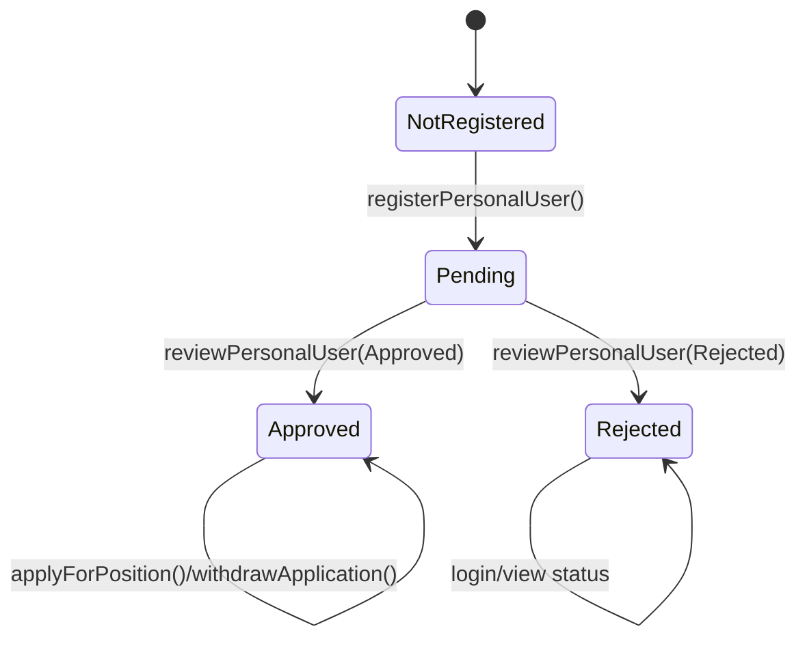
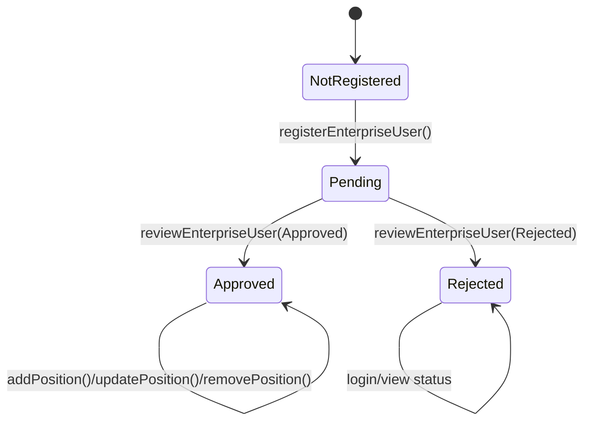
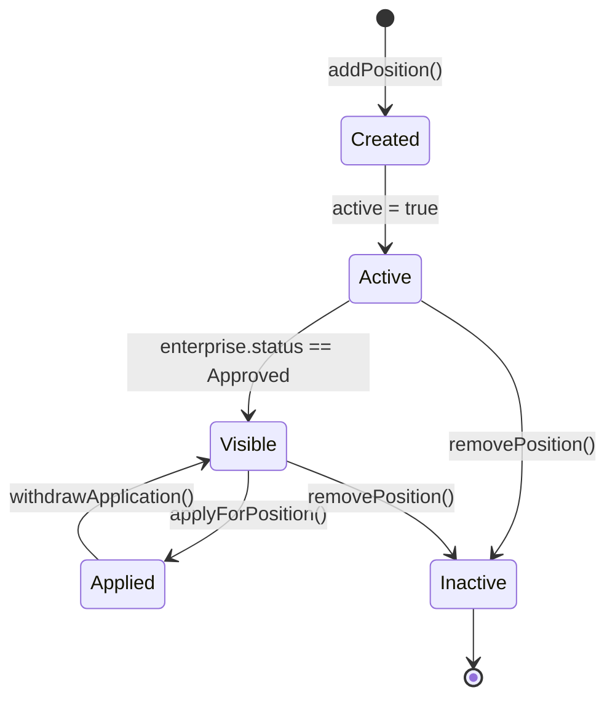
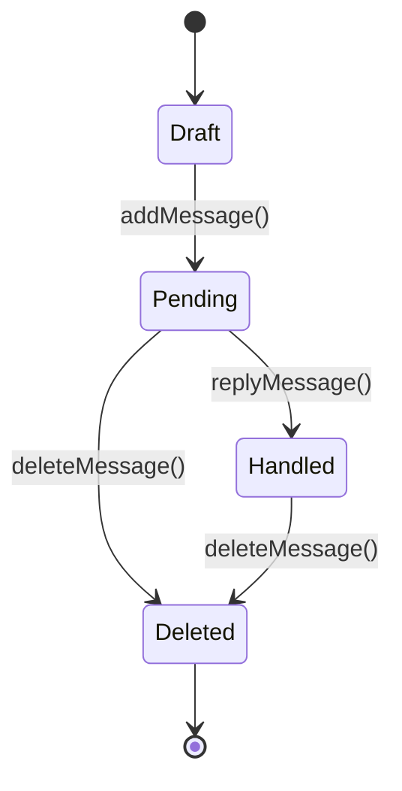
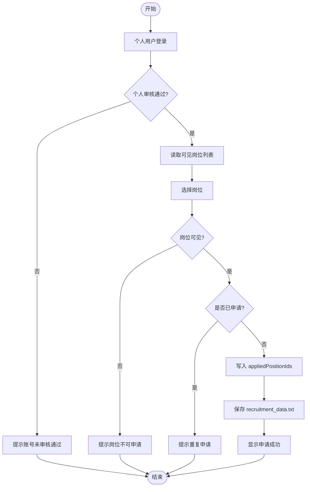
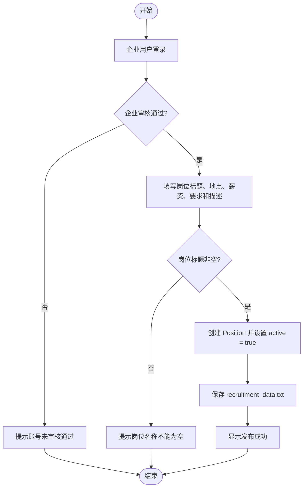
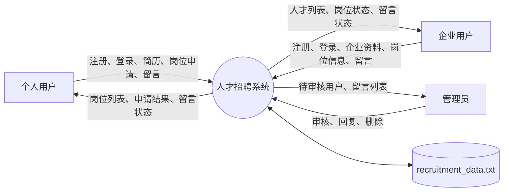
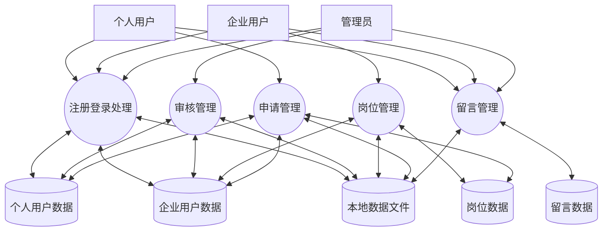

# 人才招聘系统动态模型

## 1. 个人用户审核状态图



说明：

1. 个人用户注册后初始状态为 `Pending`。
2. 管理员审核后状态变为 `Approved` 或 `Rejected`。
3. `Approved` 用户可以维护资料、维护简历、申请岗位和撤销申请。
4. 申请岗位时仍需检查岗位是否可见以及是否重复申请。

## 2. 企业用户审核状态图



说明：

1. 企业用户注册后初始状态为 `Pending`。
2. 只有 `Approved` 企业用户可以发布岗位。
3. 企业用户只能修改或下架自己发布且仍处于启用状态的岗位。

## 3. 岗位生命周期状态图



说明：

1. 岗位创建后 `active = true`。
2. 岗位对个人用户可见需要同时满足 `active = true` 和发布企业已审核通过。
3. 下架岗位设置 `active = false`，不再进入可见岗位列表。

## 4. 留言处理状态图



说明：

1. 个人用户和企业用户均可提交留言。
2. 新留言默认 `handled = false`。
3. 管理员回复后保存回复内容并设置 `handled = true`。
4. 管理员可以删除未处理或已处理留言。

## 5. 个人用户申请岗位活动图



## 6. 企业用户发布岗位活动图



## 7. 数据流图

### 7.1 上下文数据流图



### 7.2 一层数据流图



## 8. OCL/逻辑约束

本系统未直接引入 OCL 执行引擎，以下约束以 OCL 风格和逻辑表达式记录，可作为 SRS、设计和测试用例的共同依据。

### 8.1 用户名唯一性

```text
context RecruitmentService
inv UniqueUsername:
  personalUsers.username ∩ enterpriseUsers.username = ∅
  and adminUsername not in personalUsers.username
  and adminUsername not in enterpriseUsers.username
```

### 8.2 个人用户岗位申请准入

```text
context applyForPosition(personalId, positionId)
pre PersonalApproved:
  personalById(personalId).status = Approved
pre PositionVisible:
  positionById(positionId).active = true
  and enterpriseById(position.enterpriseId).status = Approved
pre NotDuplicate:
  positionId not in personalById(personalId).appliedPositionIds
post ApplicationRecorded:
  positionId in personalById(personalId).appliedPositionIds
```

### 8.3 企业用户发布岗位准入

```text
context addPosition(enterpriseId, title, location, salary, requirement, description)
pre EnterpriseApproved:
  enterpriseById(enterpriseId).status = Approved
pre TitleRequired:
  title <> ""
post PositionCreated:
  positions includes new Position
  and new Position.active = true
```

### 8.4 岗位可见性

```text
context visiblePositions()
post VisibleOnly:
  result->forAll(p |
    p.active = true and enterpriseById(p.enterpriseId).status = Approved
  )
```

### 8.5 岗位修改与下架权限

```text
context updatePosition(enterpriseId, positionId, ...)
pre OwnActivePosition:
  positionById(positionId).enterpriseId = enterpriseId
  and positionById(positionId).active = true

context removePosition(enterpriseId, positionId)
pre OwnActivePosition:
  positionById(positionId).enterpriseId = enterpriseId
  and positionById(positionId).active = true
post PositionInactive:
  positionById(positionId).active = false
```

### 8.6 留言处理约束

```text
context addMessage(senderType, senderName, content)
pre ContentRequired:
  content <> ""
post MessagePending:
  new Message.handled = false

context replyMessage(messageId, reply)
pre ReplyRequired:
  reply <> ""
post MessageHandled:
  messageById(messageId).handled = true
  and messageById(messageId).reply = reply
```
