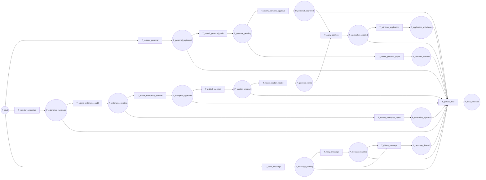

# 人才招聘系统 Petri 网模型

## 1. 建模范围

本模型围绕人才招聘系统的核心业务闭环建模，包括：

1. 个人用户注册与审核。
2. 企业用户注册与审核。
3. 企业发布岗位并形成可见岗位。
4. 个人用户申请或撤销岗位申请。
5. 用户留言与管理员处理留言。

Petri 网用于说明这些流程之间的前置条件、并发关系、同步关系和冲突关系。

## 2. 基本元素定义

### 2.1 库所 Place

| 编号 | 库所 | 含义 |
|---|---|---|
| P0 | `P_start` | 系统可接收用户操作的初始状态。 |
| P1 | `P_personal_registered` | 个人用户注册信息已提交。 |
| P2 | `P_personal_pending` | 个人用户等待管理员审核。 |
| P3 | `P_personal_approved` | 个人用户审核通过。 |
| P4 | `P_personal_rejected` | 个人用户审核驳回。 |
| P5 | `P_enterprise_registered` | 企业用户注册信息已提交。 |
| P6 | `P_enterprise_pending` | 企业用户等待管理员审核。 |
| P7 | `P_enterprise_approved` | 企业用户审核通过。 |
| P8 | `P_enterprise_rejected` | 企业用户审核驳回。 |
| P9 | `P_position_created` | 岗位已创建。 |
| P10 | `P_position_visible` | 岗位已启用且发布企业已审核通过。 |
| P11 | `P_application_created` | 个人用户已申请岗位。 |
| P12 | `P_application_withdrawn` | 个人用户已撤销岗位申请。 |
| P13 | `P_message_pending` | 留言待管理员处理。 |
| P14 | `P_message_handled` | 留言已回复。 |
| P15 | `P_message_deleted` | 留言已删除。 |
| P16 | `P_data_persisted` | 业务变更已保存到本地数据文件。 |

### 2.2 变迁 Transition

| 编号 | 变迁 | 对应系统操作 |
|---|---|---|
| T1 | `T_register_personal` | `registerPersonalUser()` |
| T2 | `T_submit_personal_audit` | 个人注册后进入待审核队列 |
| T3 | `T_review_personal_approve` | `reviewPersonalUser(Approved)` |
| T4 | `T_review_personal_reject` | `reviewPersonalUser(Rejected)` |
| T5 | `T_register_enterprise` | `registerEnterpriseUser()` |
| T6 | `T_submit_enterprise_audit` | 企业注册后进入待审核队列 |
| T7 | `T_review_enterprise_approve` | `reviewEnterpriseUser(Approved)` |
| T8 | `T_review_enterprise_reject` | `reviewEnterpriseUser(Rejected)` |
| T9 | `T_publish_position` | `addPosition()` |
| T10 | `T_make_position_visible` | 岗位满足可见条件 |
| T11 | `T_apply_position` | `applyForPosition()` |
| T12 | `T_withdraw_application` | `withdrawApplication()` |
| T13 | `T_leave_message` | `addMessage()` |
| T14 | `T_reply_message` | `replyMessage()` |
| T15 | `T_delete_message` | `deleteMessage()` |
| T16 | `T_persist_data` | `save()` |

## 3. Petri 网结构图



## 4. 初始标识与发生规则

### 4.1 初始标识

系统处于可接收操作状态时，设初始标识为：

```text
M0 = { P_start: 1 }
```

对于实际系统，多个个人用户、企业用户、岗位和留言可对应多个同类标识。为便于课程建模，本模型按单个业务实例说明流程。

### 4.2 典型发生序列

个人用户注册审核序列：

```text
P_start -> T_register_personal -> P_personal_registered
P_personal_registered -> T_submit_personal_audit -> P_personal_pending
P_personal_pending -> T_review_personal_approve -> P_personal_approved
```

企业发布岗位序列：

```text
P_start -> T_register_enterprise -> P_enterprise_registered
P_enterprise_registered -> T_submit_enterprise_audit -> P_enterprise_pending
P_enterprise_pending -> T_review_enterprise_approve -> P_enterprise_approved
P_enterprise_approved -> T_publish_position -> P_position_created
P_position_created -> T_make_position_visible -> P_position_visible
```

岗位申请同步序列：

```text
P_personal_approved + P_position_visible -> T_apply_position -> P_application_created
```

该序列表示 `T_apply_position` 只有在个人用户已审核通过且岗位可见时才能发生。

## 5. 并发、同步和冲突分析

### 5.1 并发性

个人用户注册审核流程与企业用户注册审核流程互不依赖：

```text
T_register_personal || T_register_enterprise
T_submit_personal_audit || T_submit_enterprise_audit
```

这说明系统可以同时存在多个待审核个人用户和多个待审核企业用户。当前系统虽然是单机桌面程序，但业务模型允许这些流程在数据层并行存在。

### 5.2 同步性

岗位申请需要两个输入条件：

```text
Input(T_apply_position) = { P_personal_approved, P_position_visible }
```

含义是：

1. 个人用户必须为 `Approved`。
2. 岗位必须处于可见状态。
3. 可见岗位又依赖发布企业为 `Approved` 且岗位 `active = true`。

该同步关系对应代码中的 `applyForPosition()` 和 `isPositionVisible()` 校验。

### 5.3 冲突性

个人审核存在通过与驳回冲突：

```text
P_personal_pending -> T_review_personal_approve -> P_personal_approved
P_personal_pending -> T_review_personal_reject -> P_personal_rejected
```

企业审核存在通过与驳回冲突：

```text
P_enterprise_pending -> T_review_enterprise_approve -> P_enterprise_approved
P_enterprise_pending -> T_review_enterprise_reject -> P_enterprise_rejected
```

因为两个变迁共享同一个待审核输入库所，所以一次审核只能选择一种结果。该冲突关系可用于约束界面和服务层逻辑，避免同一个审核对象同时具有多个审核状态。

### 5.4 互斥与重复申请控制

岗位申请应满足“同一个人对同一岗位只能申请一次”。在 Petri 网中可将 `P_application_created` 视为已占用标识。当该标识存在时，`T_apply_position` 对同一用户和同一岗位实例不应再次发生。对应代码中的判断为：

```text
positionId not in personal.appliedPositionIds
```

## 6. 性质分析

### 6.1 可达性

从初始标识 `M0` 出发，可以到达以下关键状态：

| 目标状态 | 可达路径 |
|---|---|
| 个人待审核 | `T_register_personal -> T_submit_personal_audit` |
| 个人审核通过 | `T_register_personal -> T_submit_personal_audit -> T_review_personal_approve` |
| 企业审核通过 | `T_register_enterprise -> T_submit_enterprise_audit -> T_review_enterprise_approve` |
| 岗位可见 | 企业审核通过后执行 `T_publish_position -> T_make_position_visible` |
| 岗位申请成功 | 个人审核通过且岗位可见后执行 `T_apply_position` |
| 留言已处理 | `T_leave_message -> T_reply_message` |

### 6.2 有界性

对单个业务实例而言，用户审核状态应是 1-有界的：

```text
P_personal_pending + P_personal_approved + P_personal_rejected <= 1
P_enterprise_pending + P_enterprise_approved + P_enterprise_rejected <= 1
```

这表示同一个用户在任意时刻只能处于一种审核状态。对实际系统的集合数据而言，库所中的标识数量可以随用户数量增加而增加，但每个用户实例的状态仍应保持有界。

### 6.3 安全性

审核状态、岗位启用状态和留言处理状态都应保持安全性：

1. 同一用户不能同时为 `Pending`、`Approved`、`Rejected`。
2. 同一岗位不能同时被视为可见和下架。
3. 同一留言不能同时处于待处理和已删除流程中。

### 6.4 活性

在管理员持续处理待审核用户和待处理留言的前提下：

1. 待审核个人用户最终可以进入通过或驳回状态。
2. 待审核企业用户最终可以进入通过或驳回状态。
3. 待处理留言最终可以进入已回复或已删除状态。

若管理员不执行审核，则个人申请岗位、企业发布可见岗位等后续流程可能停滞。因此管理员审核是系统业务闭环的关键变迁。

### 6.5 守恒性

对单个审核对象，审核状态标识在待审核、通过、驳回之间转移，不应凭空产生多个审核状态。对岗位申请，申请标识可以在申请成功和撤销之间转移。该性质对应系统中通过修改对象字段和持久化保存来维护状态一致性。

## 7. 对设计和测试的启示

| Petri 网结论 | 对系统设计的启示 | 对测试的启示 |
|---|---|---|
| 申请岗位需要同步两个输入条件 | 将审核状态和岗位可见性校验放在服务层 | 测试未审核个人、下架岗位、企业未审核岗位不可申请 |
| 审核通过与驳回存在冲突 | 审核操作应写入唯一状态字段 | 测试同一用户审核后状态唯一 |
| 留言回复与删除改变流程状态 | 留言处理应统一保存 `handled` 和 `reply` | 测试空回复、回复后删除、未处理删除 |
| 数据变更后需要持久化 | 所有业务变更调用 `persist()` | 测试重启后数据仍存在 |
| 重复申请应被互斥约束阻止 | 使用 `appliedPositionIds` 检查重复 | 测试同一用户不能重复申请同一岗位 |
