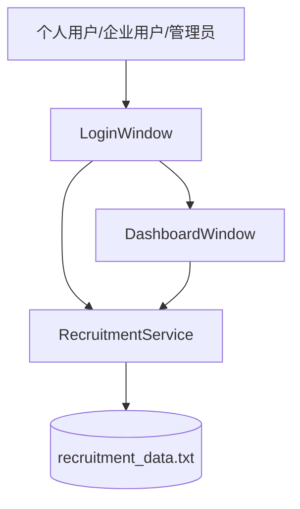
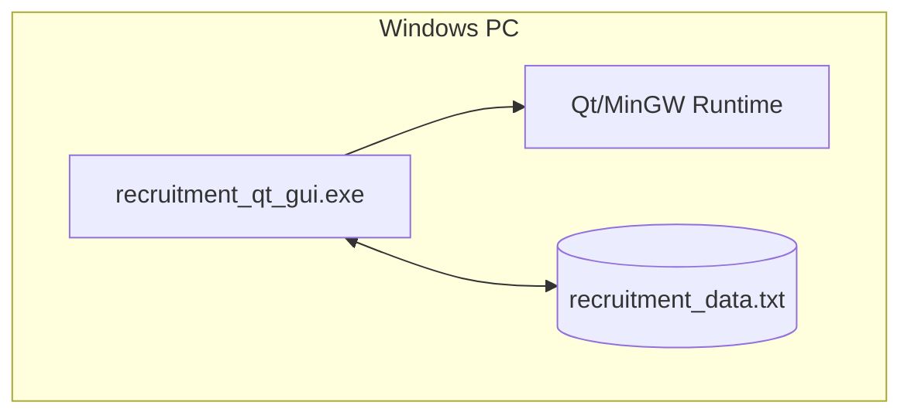

# 人才招聘系统软件体系结构设计文档 SAD 初稿

## 1. 引言

### 1.1 编写目的

本文档描述人才招聘系统的软件体系结构，明确系统的架构目标、利益相关者关注点、架构视图、组件职责、接口关系、运行部署方式、关键设计决策和风险。本文档用于指导后续详细设计、测试设计、维护和课程答辩。

### 1.2 系统范围

人才招聘系统是一个基于 `C++ + Qt Widgets` 的 Windows 桌面端招聘管理系统，面向个人用户、企业用户和管理员三类角色。系统支持用户注册登录、审核、简历维护、岗位管理、岗位申请、留言处理和本地数据持久化。

### 1.3 参考资料

1. `software_engineering_experiments/experiment_07/srs_draft.md`
2. `software_engineering_experiments/experiment_08/dynamic_models.md`
3. `software_engineering_experiments/experiment_08/petri_net_model.md`
4. `qt_gui/recruitment_service.h`
5. `qt_gui/login_window.h`
6. `qt_gui/dashboard_window.h`
7. ISO/IEC/IEEE 42010:2022 Architecture description

### 1.4 术语

| 术语 | 说明 |
|---|---|
| SAD | Software Architecture Document，软件体系结构设计文档。 |
| SRS | Software Requirements Specification，软件需求规格说明。 |
| 视点 | 针对特定利益相关者关注点定义的架构观察方式。 |
| 视图 | 按某一视点构造出的架构模型。 |
| 表示层 | 负责界面展示和用户交互的代码层。 |
| 业务层 | 负责业务规则、状态校验和数据变更的代码层。 |
| 数据层 | 负责数据持久化的存储机制。 |

## 2. 架构目标与约束

### 2.1 架构目标

| 编号 | 目标 | 说明 |
|---|---|---|
| AG-01 | 功能闭环 | 支持课程要求中的核心招聘流程。 |
| AG-02 | 易演示 | 在 Windows + Qt 环境中可快速构建和运行。 |
| AG-03 | 可维护 | UI 交互与业务规则分离，减少修改影响范围。 |
| AG-04 | 可测试 | 关键业务规则集中于服务类，便于设计测试用例。 |
| AG-05 | 数据可恢复 | 业务变更后写入本地数据文件，重启后可加载。 |
| AG-06 | 文档一致 | SRS、模型、SAD 和代码结构保持一致。 |

### 2.2 技术约束

1. 开发语言为 C++17。
2. GUI 框架为 Qt Widgets。
3. 运行平台为 Windows 桌面环境。
4. 当前存储方式为本地文本文件 `recruitment_data.txt`。
5. 项目规模为课程演示级，不设计网络服务端和多用户并发访问。
6. 构建方式支持 CMake 和已有批处理脚本。

## 3. 利益相关者与关注点

| 利益相关者 | 关注点 |
|---|---|
| 个人用户 | 能否维护简历、查询岗位、申请岗位、撤销申请、留言。 |
| 企业用户 | 能否维护企业资料、发布岗位、修改岗位、下架岗位、查询人才。 |
| 管理员 | 能否审核用户、回复留言、删除留言、维护准入秩序。 |
| 开发人员 | 代码结构是否清晰，模块职责是否明确，修改影响是否可控。 |
| 测试人员 | 业务规则是否集中，异常流程是否清楚，测试点是否可追踪。 |
| 课程审阅人员 | 文档是否完整，模型是否与代码一致，项目是否能演示。 |

## 4. 架构概览

系统采用单进程三层架构：

1. 表示层：由 `LoginWindow` 和 `DashboardWindow` 构成，负责角色入口、表单输入、表格展示和用户提示。
2. 业务层：由 `RecruitmentService` 构成，负责用户、岗位、申请、留言和管理员密码相关业务规则。
3. 数据层：由本地文本文件 `recruitment_data.txt` 构成，负责持久化保存业务数据。



## 5. 架构视点与视图

| 视点 | 主要利益相关者 | 关注点 | 对应视图 |
|---|---|---|---|
| 上下文视点 | 用户、课程审阅人员 | 系统边界和外部角色 | 上下文视图 |
| 逻辑视点 | 开发人员、测试人员 | 领域对象和业务关系 | 逻辑视图 |
| 组件视点 | 开发人员 | 模块职责和依赖关系 | 组件视图 |
| 运行视点 | 开发人员、测试人员 | 运行时调用顺序和状态变化 | 序列视图、状态视图 |
| 数据视点 | 开发人员、测试人员 | 数据结构、持久化和一致性 | 数据视图 |
| 部署视点 | 开发人员、演示人员 | 构建、运行和文件位置 | 部署视图 |

详细视图见 `architecture_views.md`。

## 6. 组件职责

### 6.1 `main.cpp`

责任：

1. 初始化 Qt 应用。
2. 创建共享的 `RecruitmentService` 实例。
3. 加载或生成初始数据。
4. 创建并显示登录窗口。

### 6.2 `LoginWindow`

责任：

1. 提供角色选择、用户名和密码输入。
2. 处理个人、企业、管理员登录。
3. 调用服务层完成个人注册和企业注册。
4. 登录成功后打开对应角色的 `DashboardWindow`。

### 6.3 `DashboardWindow`

责任：

1. 根据角色构建不同标签页。
2. 展示个人资料、企业资料、岗位列表、人才列表、待审核列表和留言列表。
3. 响应按钮操作并调用 `RecruitmentService`。
4. 调用 `refreshData()` 保持界面状态与服务层数据一致。

### 6.4 `RecruitmentService`

责任：

1. 管理个人用户、企业用户、岗位和留言集合。
2. 提供注册、登录、审核、岗位、申请、留言和密码修改接口。
3. 执行业务规则校验。
4. 统一读写 `recruitment_data.txt`。
5. 提供查询接口供界面层展示数据。

### 6.5 `recruitment_data.txt`

责任：

1. 保存下一组编号种子。
2. 保存管理员密码。
3. 保存个人用户、企业用户、岗位和留言数据。
4. 在系统启动时作为数据恢复来源。

## 7. 接口设计

### 7.1 表示层到业务层接口

表示层通过 `RecruitmentService` 的公开方法访问业务功能：

| 功能 | 服务接口 |
|---|---|
| 个人注册 | `registerPersonalUser()` |
| 企业注册 | `registerEnterpriseUser()` |
| 个人登录 | `loginPersonal()` |
| 企业登录 | `loginEnterprise()` |
| 管理员登录 | `loginAdmin()` |
| 岗位申请 | `applyForPosition()` |
| 撤销申请 | `withdrawApplication()` |
| 企业发布岗位 | `addPosition()` |
| 企业修改岗位 | `updatePosition()` |
| 企业下架岗位 | `removePosition()` |
| 管理员审核用户 | `reviewPersonalUser()`、`reviewEnterpriseUser()` |
| 留言处理 | `addMessage()`、`replyMessage()`、`deleteMessage()` |

### 7.2 业务层到数据层接口

业务层通过 `load()`、`save()` 和 `persist()` 操作本地数据文件。界面层不直接解析或写入 `recruitment_data.txt`。

## 8. 数据设计

核心数据对象：

| 对象 | 关键字段 |
|---|---|
| `PersonalUser` | `id`、`username`、`password`、`resume`、`appliedPositionIds`、`status` |
| `EnterpriseUser` | `id`、`username`、`password`、`companyName`、`status` |
| `Position` | `id`、`enterpriseId`、`title`、`active` |
| `Message` | `id`、`senderType`、`senderName`、`content`、`handled`、`reply` |

数据一致性约束：

1. 用户名在个人用户、企业用户和管理员之间唯一。
2. 个人用户和企业用户审核状态只允许为 `Pending`、`Approved`、`Rejected`。
3. 可见岗位必须满足 `active = true` 且企业审核通过。
4. 同一个人用户不能重复申请同一岗位。
5. 留言回复后必须同时保存回复内容和处理状态。

## 9. 运行时设计

### 9.1 启动流程

1. `main.cpp` 创建 `RecruitmentService`。
2. 调用 `loadOrSeed()`。
3. 如数据文件存在且格式正确，加载已有数据。
4. 如加载失败，生成样例数据并保存。
5. 显示 `LoginWindow`。

### 9.2 登录流程

1. 用户选择角色并输入账号密码。
2. `LoginWindow` 调用对应登录方法。
3. 登录成功后创建对应角色的 `DashboardWindow`。
4. 登录失败时停留在登录窗口并提示。

### 9.3 岗位申请流程

1. 个人用户在工作台选择可见岗位。
2. `DashboardWindow` 调用 `applyForPosition()`。
3. 服务层检查个人用户存在、审核通过、岗位可见、未重复申请。
4. 服务层写入 `appliedPositionIds` 并保存数据。
5. 界面刷新已申请岗位列表。

## 10. 部署设计

当前系统为单机桌面部署：



构建入口：

```powershell
cd qt_gui
.\build_qt_gui.bat
```

运行入口：

```powershell
cd qt_gui
.\run_qt_gui.bat
```

## 11. 架构决策

| 编号 | 决策 | 理由 | 影响 |
|---|---|---|---|
| ADR-01 | 使用 Qt Widgets 构建桌面 GUI | 适合 Windows 课程演示，已有项目代码和构建脚本支持 | 不支持浏览器访问和在线部署。 |
| ADR-02 | 采用表示层、业务层、数据层三层结构 | 降低 UI 和业务规则耦合 | 服务类承担较多业务职责，后续可继续拆分。 |
| ADR-03 | 使用 `RecruitmentService` 集中业务规则 | 便于测试和维护业务约束 | 类规模较大，后续可拆分用户服务、岗位服务和留言服务。 |
| ADR-04 | 使用本地文本文件保存数据 | 实现简单，满足课程演示 | 数据安全性和事务能力有限，后续可迁移 SQLite。 |
| ADR-05 | 通过构造函数注入共享服务实例 | 窗口不负责创建业务服务，便于共享状态 | 需要保证服务对象生命周期覆盖窗口生命周期。 |

## 12. 质量属性设计

| 质量属性 | 设计措施 |
|---|---|
| 可维护性 | UI 与业务服务分离，数据读写集中封装。 |
| 易用性 | 角色化工作台、表格展示、失败提示和刷新机制。 |
| 可靠性 | 数据变更后调用 `persist()` 保存。 |
| 安全性 | 角色入口隔离、业务层检查审核状态和岗位权限。 |
| 可测试性 | 业务规则集中于 `RecruitmentService`，可围绕服务方法设计测试。 |
| 可扩展性 | 后续可将数据层替换为 SQLite，或将业务服务拆分为多个服务类。 |

## 13. 风险与改进计划

| 风险 | 影响 | 改进计划 |
|---|---|---|
| 明文密码存储 | 安全性不足 | 后续实现密码哈希和盐值。 |
| 文本文件存储缺少事务 | 异常中断可能影响数据一致性 | 后续迁移 SQLite 或增加备份文件机制。 |
| `RecruitmentService` 职责较集中 | 类体积继续增长会影响维护 | 后续拆分为用户、岗位、留言和存储模块。 |
| GUI 与业务测试未完全自动化 | 回归测试依赖人工 | 实验十一补充测试计划和测试用例。 |

## 14. 对应关系与一致性

| SRS 内容 | SAD 对应内容 | 代码对应内容 |
|---|---|---|
| 用户注册登录 | 表示层、业务层、登录流程 | `LoginWindow`、`RecruitmentService` |
| 用户审核 | 管理员工作台、审核状态约束 | `DashboardWindow`、`reviewPersonalUser()`、`reviewEnterpriseUser()` |
| 岗位管理 | 企业用户工作台、岗位生命周期 | `addPosition()`、`updatePosition()`、`removePosition()` |
| 岗位申请 | 岗位申请运行流程、同步约束 | `applyForPosition()`、`withdrawApplication()` |
| 留言处理 | 留言状态和管理员处理流程 | `addMessage()`、`replyMessage()`、`deleteMessage()` |
| 数据持久化 | 数据层和部署视图 | `load()`、`save()`、`recruitment_data.txt` |
