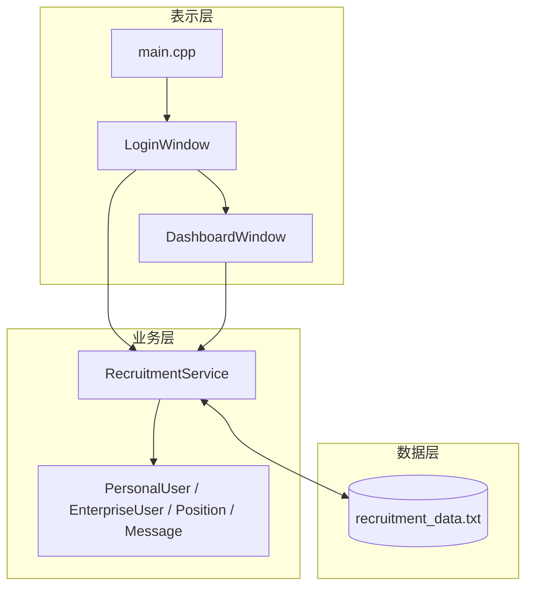
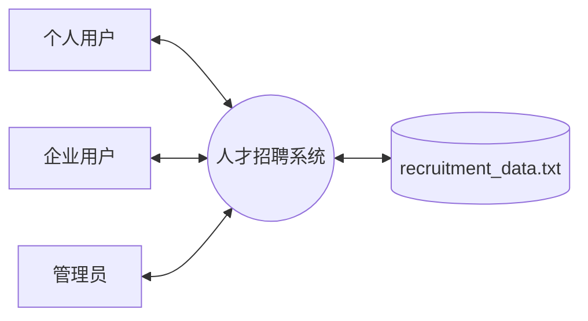
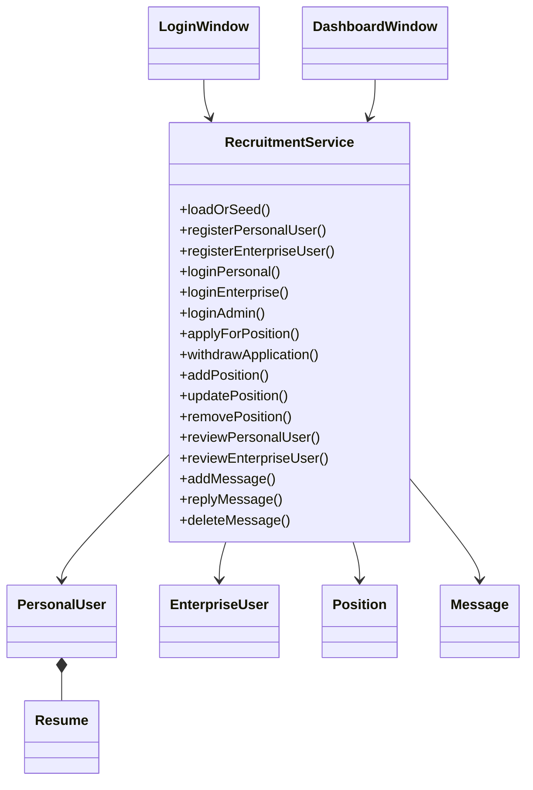
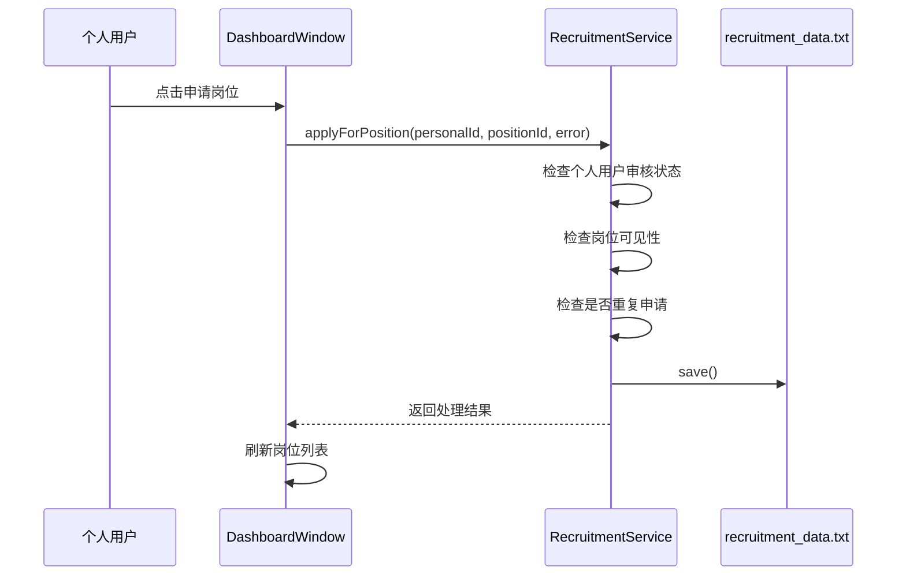
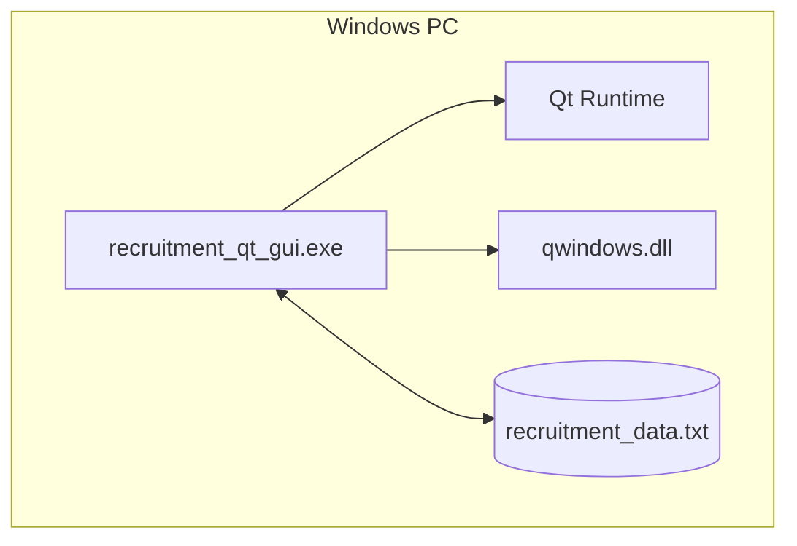

# 人才招聘系统软件体系结构设计文档 SAD 定稿

## 1. 引言

### 1.1 编写目的

本文档是人才招聘系统的软件体系结构设计文档定稿，用于提交课程体系结构设计作业，并作为后续测试、维护和答辩的架构依据。文档说明系统的架构目标、约束、视图、组件职责、接口、数据、运行、部署、错误处理、安全设计、架构决策和改进计划。

### 1.2 项目范围

人才招聘系统是一个 Windows 桌面端招聘管理系统，使用 `C++17 + Qt Widgets` 实现。系统包含个人用户、企业用户和管理员三类角色，支持注册登录、审核、资料维护、简历维护、岗位发布、岗位查询、岗位申请、留言处理和本地数据保存。

### 1.3 读者对象

| 读者 | 关注内容 |
|---|---|
| 开发人员 | 模块划分、接口调用、数据结构和后续改进。 |
| 测试人员 | 业务规则、运行流程、异常处理和测试点。 |
| 课程审阅人员 | SAD 完整性、架构合理性、文档与代码一致性。 |
| 维护人员 | 组件职责、风险和演进路径。 |

### 1.4 参考资料

1. 实验七 SRS 初稿。
2. 实验八动态模型和 Petri 网模型。
3. 实验九 SAD 初稿和 SRS 定稿。
4. 当前代码：`qt_gui/main.cpp`、`qt_gui/login_window.*`、`qt_gui/dashboard_window.*`、`qt_gui/recruitment_service.*`。
5. ISO/IEC/IEEE 42010 架构描述思想。

## 2. 架构背景

### 2.1 系统现状

当前系统已经形成可运行的 Qt 图形化版本，主要代码位于 `qt_gui/`：

| 文件 | 责任 |
|---|---|
| `main.cpp` | 程序入口，创建服务对象和登录窗口。 |
| `login_window.h/.cpp` | 登录、角色选择、个人注册和企业注册。 |
| `dashboard_window.h/.cpp` | 三类角色工作台、表格展示和按钮事件处理。 |
| `recruitment_service.h/.cpp` | 领域对象定义、业务规则、查询和数据持久化。 |
| `recruitment_data.txt` | 本地数据文件。 |
| `build_qt_gui.bat` | Windows 本地构建脚本。 |
| `run_qt_gui.bat` | 运行脚本。 |

### 2.2 架构设计原则

1. 简单优先：以课程演示和文档提交为目标，避免过度工程化。
2. 分层清晰：界面展示、业务规则、数据持久化职责分离。
3. 规则集中：核心业务校验放在 `RecruitmentService`。
4. 视图一致：SRS、SAD、动态模型和代码互相可追踪。
5. 可演进：为后续测试、数据库迁移和服务拆分保留路径。

## 3. 架构目标与约束

### 3.1 架构目标

| 编号 | 目标 | 说明 |
|---|---|---|
| AG-01 | 支持核心业务闭环 | 三类角色流程完整可演示。 |
| AG-02 | 保持模块职责清晰 | UI 处理交互，服务层处理业务规则。 |
| AG-03 | 保证数据可恢复 | 业务变更保存到本地文件。 |
| AG-04 | 支撑测试设计 | 服务层规则可映射到测试用例。 |
| AG-05 | 支撑课程提交 | 文档结构完整，模型与代码一致。 |
| AG-06 | 保留演进空间 | 后续可迁移 SQLite、拆分服务、增强安全。 |

### 3.2 架构约束

1. 系统运行在 Windows 桌面环境。
2. 使用 Qt Widgets，不使用 Web 前端。
3. 当前不设计服务器端和网络通信。
4. 当前数据存储为本地文本文件。
5. 数据规模为课程演示级。
6. 构建依赖本机 Qt 和 MinGW 路径。

## 4. 利益相关者与关注点

| 利益相关者 | 关注点 |
|---|---|
| 个人用户 | 岗位查询、简历维护、申请岗位和撤销申请是否顺畅。 |
| 企业用户 | 企业资料、岗位发布和人才查询是否可用。 |
| 管理员 | 审核用户和处理留言是否集中清晰。 |
| 开发人员 | 模块边界、接口职责和修改影响范围。 |
| 测试人员 | 业务规则、异常流程和数据持久化是否可验证。 |
| 审阅人员 | 文档完整性、模型质量和架构合理性。 |

## 5. 总体架构

系统采用三层架构：

### 5.1 表示层

表示层负责用户输入、界面展示和操作反馈。它不保存业务状态，不直接读写数据文件。

### 5.2 业务层

业务层负责所有核心业务规则，包括：

1. 用户名唯一校验。
2. 注册和登录。
3. 审核状态维护。
4. 岗位可见性判断。
5. 岗位申请和撤销。
6. 留言处理。
7. 数据保存和加载。

### 5.3 数据层

数据层目前由文本文件承载。文件格式由 `RecruitmentService` 内部维护，外部模块不依赖具体格式。

## 6. 架构视图

### 6.1 上下文视图

### 6.2 逻辑视图

### 6.3 运行视图：申请岗位

### 6.4 部署视图

## 7. 组件设计

### 7.1 `main.cpp`

输入：命令行参数、Qt 运行环境。

输出：启动应用窗口。
主要职责：

1. 创建 `QApplication`。
2. 创建 `RecruitmentService`。
3. 调用 `loadOrSeed()` 初始化数据。
4. 显示 `LoginWindow`。

### 7.2 `LoginWindow`

输入：用户角色、用户名、密码、注册表单信息。

输出：登录结果、注册结果、工作台窗口。
主要职责：

1. 构建登录界面。
2. 分角色调用登录接口。
3. 调用个人和企业注册接口。
4. 登录成功后创建 `DashboardWindow`。

### 7.3 `DashboardWindow`

输入：当前角色、当前用户编号、用户按钮操作。

输出：工作台界面、提示信息、刷新后的表格。
主要职责：

1. 按角色构建标签页。
2. 展示个人资料、企业资料、岗位、人才、待审核用户和留言。
3. 调用服务层处理业务操作。
4. 刷新界面数据。

### 7.4 `RecruitmentService`

输入：窗口层传入的业务参数。

输出：业务结果、错误信息、查询结果。
主要职责：

1. 维护领域对象集合。
2. 执行业务规则。
3. 提供查询和变更接口。
4. 读写数据文件。

## 8. 接口设计

### 8.1 注册登录接口

| 方法 | 说明 |
|---|---|
| `registerPersonalUser()` | 注册个人用户，默认待审核。 |
| `registerEnterpriseUser()` | 注册企业用户，默认待审核。 |
| `loginPersonal()` | 个人用户登录。 |
| `loginEnterprise()` | 企业用户登录。 |
| `loginAdmin()` | 管理员登录。 |

### 8.2 个人用户接口

| 方法 | 说明 |
|---|---|
| `updatePersonalInfo()` | 修改个人资料。 |
| `updatePersonalResume()` | 修改简历。 |
| `applyForPosition()` | 申请岗位。 |
| `withdrawApplication()` | 撤销申请。 |
| `changePersonalPassword()` | 修改个人密码。 |

### 8.3 企业用户接口

| 方法 | 说明 |
|---|---|
| `updateEnterpriseInfo()` | 修改企业资料。 |
| `addPosition()` | 发布岗位。 |
| `updatePosition()` | 修改岗位。 |
| `removePosition()` | 下架岗位。 |
| `changeEnterprisePassword()` | 修改企业密码。 |

### 8.4 管理员接口

| 方法 | 说明 |
|---|---|
| `reviewPersonalUser()` | 审核个人用户。 |
| `reviewEnterpriseUser()` | 审核企业用户。 |
| `replyMessage()` | 回复留言。 |
| `deleteMessage()` | 删除留言。 |
| `changeAdminPassword()` | 修改管理员密码。 |

## 9. 数据设计

### 9.1 核心对象

| 对象 | 说明 |
|---|---|
| `PersonalUser` | 个人用户信息、简历、已申请岗位和审核状态。 |
| `Resume` | 个人简历内容。 |
| `EnterpriseUser` | 企业资料和审核状态。 |
| `Position` | 岗位信息、企业编号和启用状态。 |
| `Message` | 留言内容、处理状态和回复。 |

### 9.2 数据一致性规则

1. 用户名唯一。
2. 用户审核状态唯一。
3. 岗位可见性由岗位启用状态和企业审核状态共同决定。
4. 个人用户不能重复申请同一岗位。
5. 删除留言后不再显示。
6. 每次业务数据变更后保存文件。

## 10. 错误处理设计

| 错误场景 | 处理方式 |
|---|---|
| 用户名为空 | 返回错误信息，界面提示。 |
| 密码为空 | 返回错误信息，界面提示。 |
| 用户名重复 | 拒绝注册并提示。 |
| 密码错误 | 登录失败并提示。 |
| 未审核用户执行受限操作 | 拒绝操作并提示。 |
| 岗位不存在或不可申请 | 拒绝申请并提示。 |
| 留言或回复为空 | 拒绝保存并提示。 |
| 保存失败 | 返回保存失败信息。 |

## 11. 安全设计

当前安全设计包括：

1. 管理员、个人用户、企业用户分角色登录。
2. 不同角色进入不同工作台。
3. 服务层检查审核状态和岗位归属。
4. 管理员负责审核准入。

已知限制：

1. 密码当前为明文存储。
2. 本地数据文件未加密。
3. 当前没有登录会话超时和操作审计。

后续改进：

1. 使用密码哈希和盐值。
2. 将数据存储迁移到 SQLite。
3. 增加操作日志。

## 12. 可测试性设计

业务规则集中在 `RecruitmentService`，可直接形成测试点：

| 测试方向 | 关键方法 |
|---|---|
| 注册登录 | `registerPersonalUser()`、`registerEnterpriseUser()`、`loginPersonal()`、`loginEnterprise()` |
| 审核 | `reviewPersonalUser()`、`reviewEnterpriseUser()` |
| 岗位 | `addPosition()`、`updatePosition()`、`removePosition()`、`visiblePositions()` |
| 申请 | `applyForPosition()`、`withdrawApplication()` |
| 留言 | `addMessage()`、`replyMessage()`、`deleteMessage()` |
| 持久化 | `load()`、`save()`、`loadOrSeed()` |

## 13. 维护设计

1. 新增字段时，应同时更新结构体、保存逻辑、加载逻辑、SRS 和 SAD 数据视图。
2. 新增角色时，应扩展 `UserRole`、登录流程和工作台构建逻辑。
3. 新增业务规则时，应优先放入 `RecruitmentService`。
4. 替换存储方式时，应优先抽取仓储接口，再迁移实现。

## 14. 架构决策记录

| 编号 | 决策 | 理由 | 后果 |
|---|---|---|---|
| ADR-01 | 使用 Qt Widgets | 与现有项目一致，适合 Windows 桌面演示 | 不支持 Web 访问。 |
| ADR-02 | 使用三层架构 | 职责清楚，课程项目易理解 | 小规模项目中 `RecruitmentService` 较集中。 |
| ADR-03 | 使用共享 `RecruitmentService` | 多窗口共享同一数据状态 | 需要控制服务生命周期。 |
| ADR-04 | 使用文本文件持久化 | 实现简单，演示方便 | 安全性和事务能力有限。 |
| ADR-05 | 业务规则集中在服务层 | 便于测试和维护 | 服务类后续可能需要拆分。 |

## 15. 风险与改进

| 风险 | 影响 | 改进 |
|---|---|---|
| 文本文件存储 | 数据一致性和安全性有限 | 迁移 SQLite。 |
| 密码明文保存 | 安全性不足 | 实现密码哈希。 |
| 服务类职责集中 | 后续维护复杂 | 拆分用户、岗位、留言和存储服务。 |
| 自动化测试不足 | 回归成本较高 | 增加服务层单元测试。 |
| 构建路径依赖本机环境 | 移植性有限 | 使用 CMake Presets 或文档化环境变量。 |

## 16. 结论

人才招聘系统当前体系结构满足课程项目的核心目标：功能闭环、结构清晰、可演示、可维护和可追踪。SAD 定稿明确了系统边界、分层结构、组件职责、接口、数据、运行、部署、质量属性和改进路径，可作为体系结构设计阶段的提交文档。
