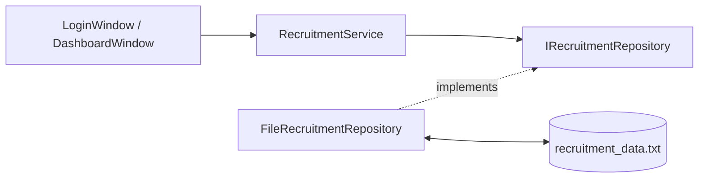

# 面向设计原则的重构建议

## 1. 重构目标

重构目标不是改变当前功能，而是在保持系统稳定的前提下提升设计质量：

1. 降低类职责集中程度。
2. 提高业务规则可测试性。
3. 降低 UI 与领域数据细节耦合。
4. 为存储迁移和功能扩展做准备。

## 2. 重构原则

1. 小步提交，每次只改变一个结构点。
2. 先补测试，再改结构。
3. 优先拆依赖最明确的部分。
4. 不在课程提交前进行高风险重构。
5. 保持 SRS、SAD 和代码同步更新。

## 3. 第一阶段：补充服务层测试

### 3.1 目标

建立 `RecruitmentService` 的基础测试，避免后续重构破坏业务规则。

### 3.2 测试点

| 测试点 | 预期 |
|---|---|
| 重复用户名注册 | 第二次注册失败。 |
| 未审核个人申请岗位 | 申请失败。 |
| 未审核企业发布岗位 | 发布失败。 |
| 下架岗位可见性 | 下架后不出现在可见岗位列表。 |
| 重复申请 | 第二次申请失败。 |
| 留言为空 | 提交失败。 |
| 数据保存加载 | 保存后重新加载数据一致。 |

### 3.3 设计原则收益

提升可测试性，为开闭原则和重构提供保护。

## 4. 第二阶段：抽取仓储层

### 4.1 当前问题

`RecruitmentService` 同时负责业务规则和文件读写：

```text
RecruitmentService = Business Rules + Data Collections + File Persistence
```

### 4.2 建议结构



### 4.3 设计原则收益

1. 单一职责原则：业务规则和持久化分离。
2. 依赖倒转原则：服务依赖仓储抽象。
3. 开闭原则：新增 SQLite 仓储时不必修改 UI。

## 5. 第三阶段：拆分工作台面板

### 5.1 当前问题

`DashboardWindow` 同时管理三类角色界面。

### 5.2 建议结构

```text
DashboardWindow
  ├── PersonalDashboardPanel
  ├── EnterpriseDashboardPanel
  └── AdminDashboardPanel
```

### 5.3 拆分方式

1. 先抽出个人用户标签页构建和刷新逻辑。
2. 再抽出企业用户标签页构建和刷新逻辑。
3. 最后抽出管理员标签页构建和刷新逻辑。
4. `DashboardWindow` 只保留容器、角色选择和公共刷新调度。

### 5.4 设计原则收益

1. 单一职责原则：每个面板只负责一个角色。
2. 迪米特法则：面板只接触自己需要的数据。
3. 合成复用原则：工作台通过组合面板复用功能。

## 6. 第四阶段：引入服务接口

### 6.1 建议结构

```cpp
class IRecruitmentService {
public:
    virtual ~IRecruitmentService() = default;
    virtual bool applyForPosition(int personalId,
                                  int positionId,
                                  std::string& error) = 0;
};
```

窗口依赖：

```cpp
std::shared_ptr<IRecruitmentService> service_;
```

### 6.2 设计原则收益

1. 依赖倒转原则：窗口依赖抽象。
2. 里氏替换原则：测试服务可以替换真实服务。
3. 开闭原则：新增远程服务实现时 UI 不变。

## 7. 第五阶段：存储安全改进

### 7.1 SQLite 迁移

将文本文件迁移到 SQLite：

1. 表结构对应 `PersonalUser`、`EnterpriseUser`、`Position`、`Message`。
2. 使用事务保存相关变更。
3. 支持更稳定的查询和持久化。

### 7.2 密码哈希

使用哈希方式保存密码：

1. 注册时保存密码哈希。
2. 登录时比较输入密码哈希。
3. 不再保存明文密码。

## 8. 推荐实施顺序

| 顺序 | 重构项 | 风险 | 收益 |
|---|---|---|---|
| 1 | 服务层测试 | 低 | 高 |
| 2 | 仓储层抽取 | 中 | 高 |
| 3 | 工作台面板拆分 | 中 | 中 |
| 4 | 服务接口抽象 | 中 | 中 |
| 5 | SQLite 与密码哈希 | 中 | 高 |

## 9. 结论

当前项目不需要立即进行大规模重构。最合适的路线是先用测试保护已有行为，再逐步拆分存储、界面和服务接口。这样既符合设计原则，也能控制对课程项目稳定性的影响。
