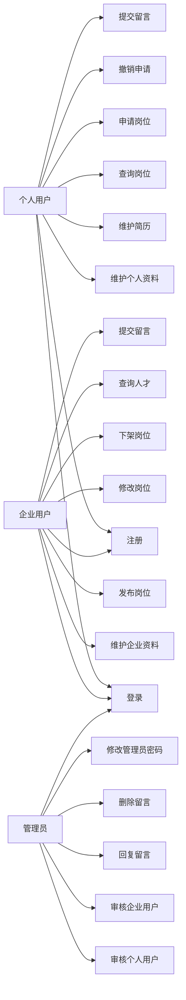
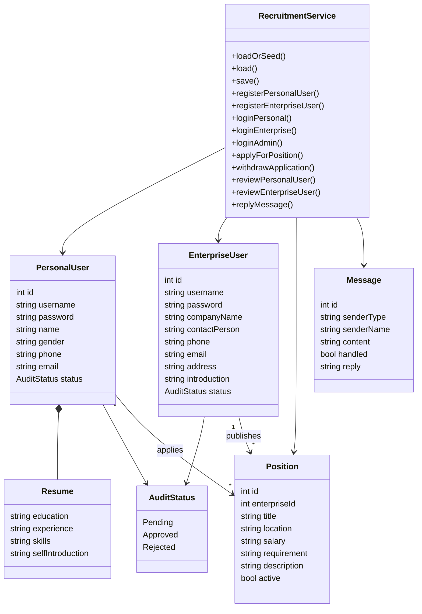
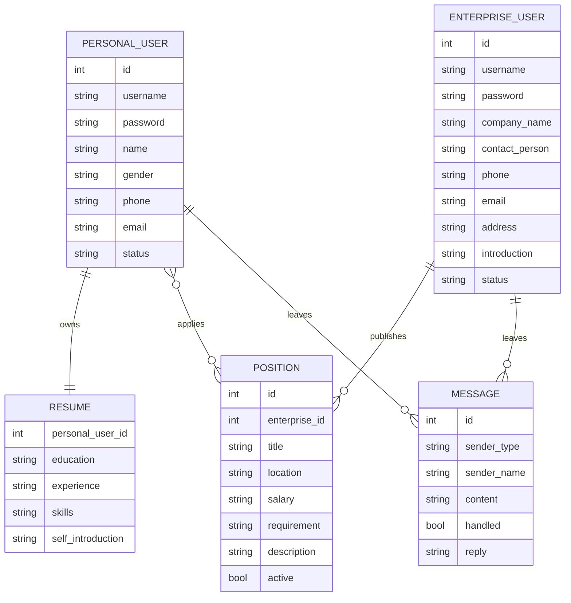
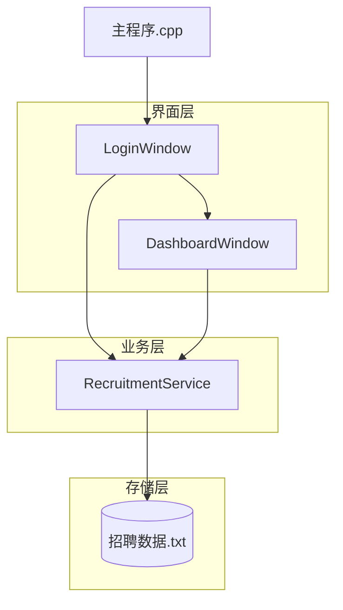

# 人才招聘系统静态模型

## 1. 用例模型

```mermaid
flowchart LR
    Personal[个人用户]
    Enterprise[企业用户]
    Admin[管理员]

    UC_Register[注册]
    UC_Login[登录]
    UC_EditProfile[维护个人资料]
    UC_EditResume[维护简历]
    UC_SearchPosition[查询岗位]
    UC_Apply[申请岗位]
    UC_Withdraw[撤销申请]
    UC_PMessage[提交留言]

    UC_EditCompany[维护企业资料]
    UC_AddPosition[发布岗位]
    UC_EditPosition[修改岗位]
    UC_RemovePosition[下架岗位]
    UC_SearchTalent[查询人才]
    UC_EMessage[提交留言]

    UC_ReviewPersonal[审核个人用户]
    UC_ReviewEnterprise[审核企业用户]
    UC_ReplyMessage[回复留言]
    UC_DeleteMessage[删除留言]
    UC_AdminPwd[修改管理员密码]

    Personal --> UC_Register
    Personal --> UC_Login
    Personal --> UC_EditProfile
    Personal --> UC_EditResume
    Personal --> UC_SearchPosition
    Personal --> UC_Apply
    Personal --> UC_Withdraw
    Personal --> UC_PMessage

    Enterprise --> UC_Register
    Enterprise --> UC_Login
    Enterprise --> UC_EditCompany
    Enterprise --> UC_AddPosition
    Enterprise --> UC_EditPosition
    Enterprise --> UC_RemovePosition
    Enterprise --> UC_SearchTalent
    Enterprise --> UC_EMessage

    Admin --> UC_Login
    Admin --> UC_ReviewPersonal
    Admin --> UC_ReviewEnterprise
    Admin --> UC_ReplyMessage
    Admin --> UC_DeleteMessage
    Admin --> UC_AdminPwd
```

## 2. 领域类图

```mermaid
classDiagram
    class RecruitmentService {
        +loadOrSeed()
        +load()
        +save()
        +registerPersonalUser()
        +registerEnterpriseUser()
        +loginPersonal()
        +loginEnterprise()
        +loginAdmin()
        +applyForPosition()
        +withdrawApplication()
        +reviewPersonalUser()
        +reviewEnterpriseUser()
        +replyMessage()
    }

    class PersonalUser {
        int id
        string username
        string password
        string name
        string gender
        string phone
        string email
        AuditStatus status
    }

    class Resume {
        string education
        string experience
        string skills
        string selfIntroduction
    }

    class EnterpriseUser {
        int id
        string username
        string password
        string companyName
        string contactPerson
        string phone
        string email
        string address
        string introduction
        AuditStatus status
    }

    class Position {
        int id
        int enterpriseId
        string title
        string location
        string salary
        string requirement
        string description
        bool active
    }

    class Message {
        int id
        string senderType
        string senderName
        string content
        bool handled
        string reply
    }

    class AuditStatus {
        Pending
        Approved
        Rejected
    }

    RecruitmentService --> PersonalUser
    RecruitmentService --> EnterpriseUser
    RecruitmentService --> Position
    RecruitmentService --> Message
    PersonalUser *-- Resume
    PersonalUser --> AuditStatus
    EnterpriseUser --> AuditStatus
    EnterpriseUser "1" --> "*" Position : publishes
    PersonalUser "*" --> "*" Position : applies
```

## 3. E-R 模型

```mermaid
erDiagram
    PERSONAL_USER ||--|| RESUME : owns
    ENTERPRISE_USER ||--o{ POSITION : publishes
    PERSONAL_USER }o--o{ POSITION : applies
    PERSONAL_USER ||--o{ MESSAGE : leaves
    ENTERPRISE_USER ||--o{ MESSAGE : leaves

    PERSONAL_USER {
        int id
        string username
        string password
        string name
        string gender
        string phone
        string email
        string status
    }

    RESUME {
        int personal_user_id
        string education
        string experience
        string skills
        string self_introduction
    }

    ENTERPRISE_USER {
        int id
        string username
        string password
        string company_name
        string contact_person
        string phone
        string email
        string address
        string introduction
        string status
    }

    POSITION {
        int id
        int enterprise_id
        string title
        string location
        string salary
        string requirement
        string description
        bool active
    }

    MESSAGE {
        int id
        string sender_type
        string sender_name
        string content
        bool handled
        string reply
    }
```

## 4. 模块结构图

```mermaid
flowchart TB
    Main[主程序.cpp]
    Login[LoginWindow]
    Dashboard[DashboardWindow]
    Service[RecruitmentService]
    Data[(招聘数据.txt)]

    Main --> Login
    Login --> Service
    Login --> Dashboard
    Dashboard --> Service
    Service --> Data

    subgraph UI[界面层]
        Login
        Dashboard
    end

    subgraph Business[业务层]
        Service
    end

    subgraph Storage[存储层]
        Data
    end
```

## 5. 静态模型说明

1. 用例模型展示三类用户与系统功能的关系。
2. 领域类图直接对应当前代码中的核心结构体和服务类。
3. E-R 模型为后续从文本文件迁移到 SQLite 提供基础。
4. 模块结构图体现界面层、业务层和存储层的分层关系。
