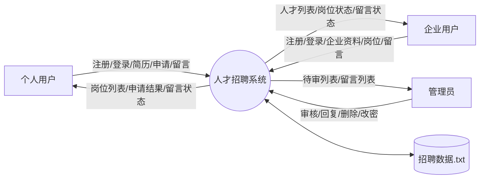
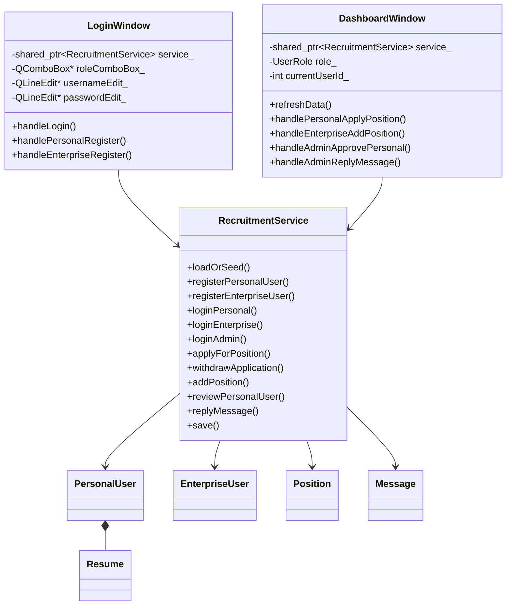
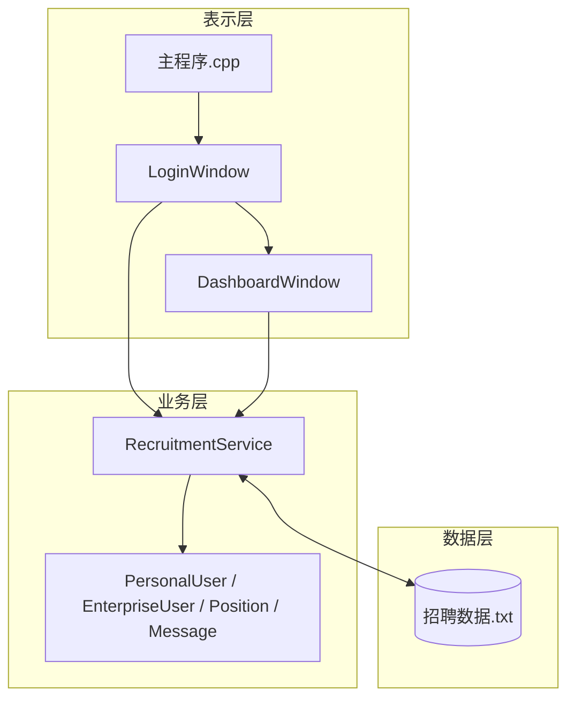
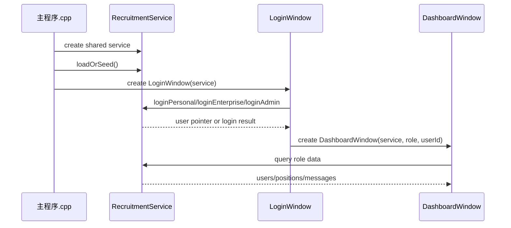
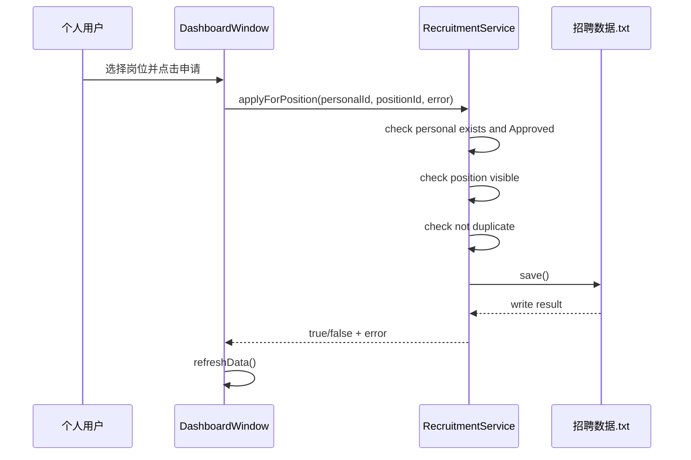
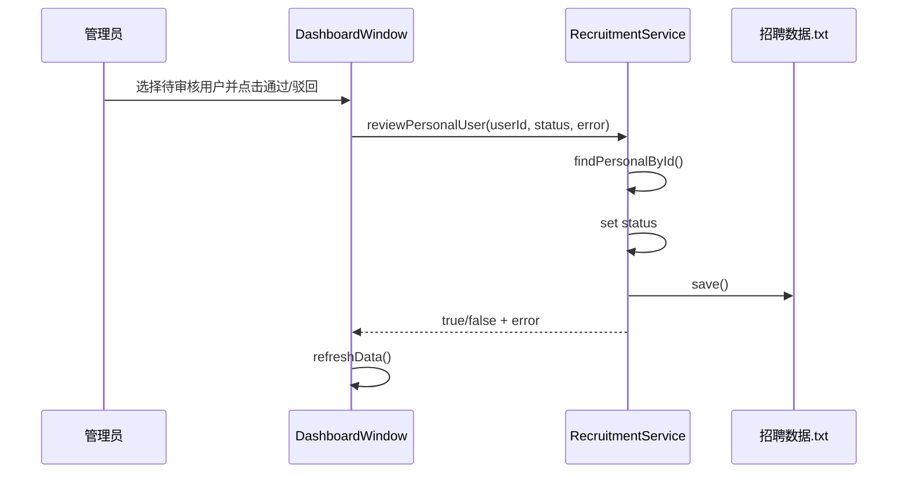
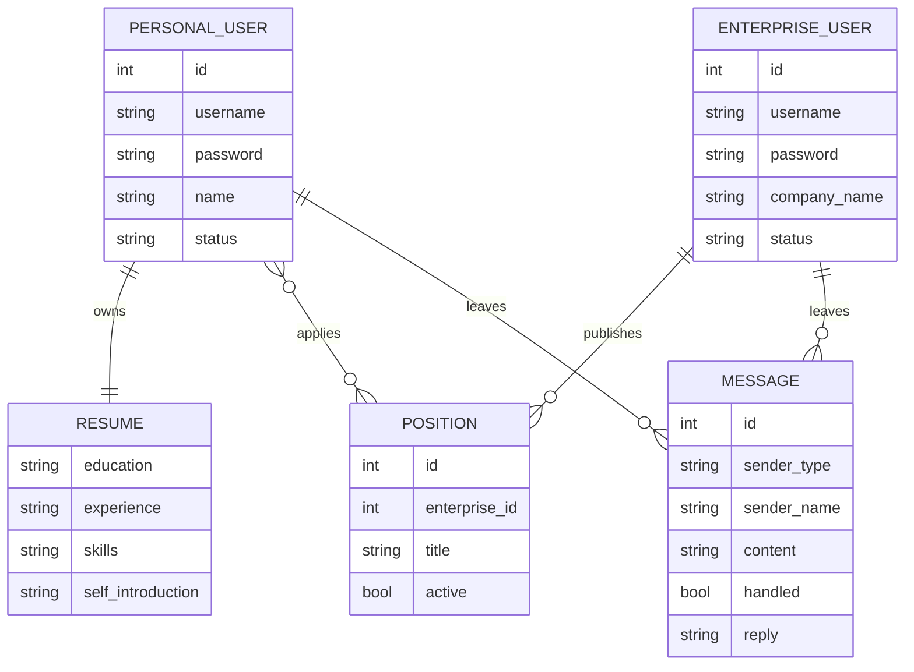
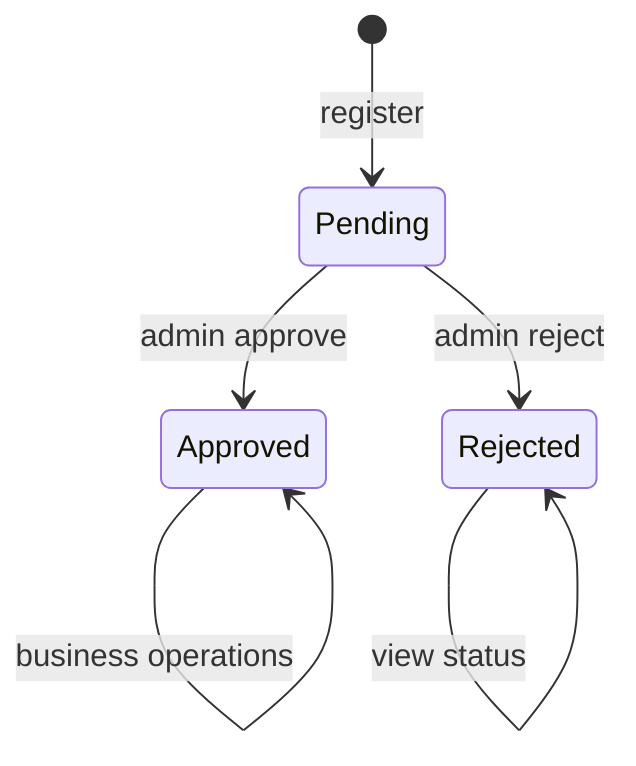
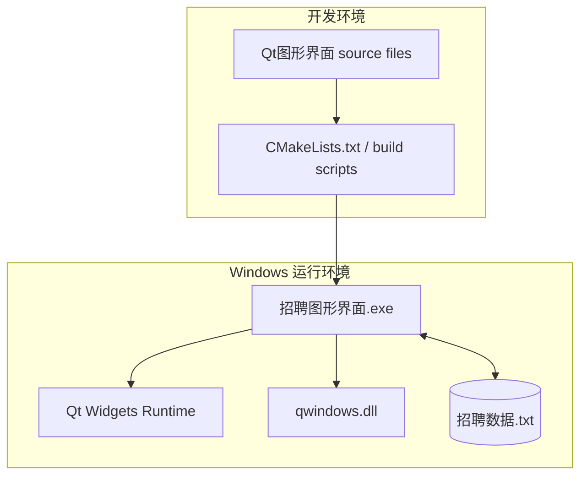

# 人才招聘系统架构视图

## 1. 上下文视图

说明：系统边界内包含 GUI、业务服务和本地数据文件读写逻辑。三类用户只通过桌面界面访问系统。

## 2. 逻辑视图

## 3. 组件视图

组件设计原则：

1. 表示层依赖业务层，业务层不依赖具体窗口类。
2. 数据文件由业务层统一访问。
3. 领域对象使用结构体承载数据，行为集中在服务类。

## 4. 运行视图

### 4.1 启动和登录序列

### 4.2 个人申请岗位序列

### 4.3 管理员审核序列

## 5. 数据视图

## 6. 状态视图

该状态视图适用于个人用户和企业用户的审核生命周期。差异在于：个人用户通过后可申请岗位，企业用户通过后可发布岗位。

## 7. 部署视图

## 8. 视图一致性规则

| 规则 | 说明 |
|---|---|
| CR-01 | 逻辑视图中的公开业务操作必须能在 `RecruitmentService` 中找到对应方法。 |
| CR-02 | 组件视图中的表示层不得直接读写 `招聘数据.txt`。 |
| CR-03 | 运行视图中的状态检查应映射到服务层的前置条件。 |
| CR-04 | 数据视图中的对象字段应与 `招聘服务.h` 保持一致。 |
| CR-05 | 部署视图中的运行文件应与 `Qt图形界面/说明文档.md` 中说明一致。 |
