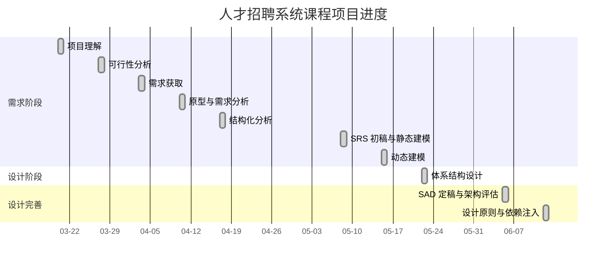

# 项目跟踪表

## 1. 里程碑跟踪

| 里程碑 | 对应实验 | 计划产出 | 当前状态 | 完成时间 |
|---|---|---|---|---|
| M1 项目理解 | 实验二 | 系统运行记录、代码结构理解 | 已完成 | 2026-03-20 |
| M2 可行性分析 | 实验三 | 可行性研究报告 | 已完成 | 2026-03-27 |
| M3 需求获取 | 实验四 | 访谈、场景、用例 | 已完成 | 2026-04-03 |
| M4 原型与需求分析 | 实验五 | 原型说明、需求分析 | 已完成 | 2026-04-10 |
| M5 结构化分析 | 实验六 | DFD、数据字典、加工说明 | 已完成 | 2026-04-17 |
| M6 SRS 初稿与静态建模 | 实验七 | SRS 初稿、静态模型 | 已完成 | 2026-05-08 |
| M7 动态建模 | 实验八 | 状态图、活动图、Petri 网 | 已完成 | 2026-05-15 |
| M8 体系结构设计 | 实验九 | SAD 初稿、架构视图、SRS 定稿 | 已完成 | 2026-05-22 |
| M9 SAD 定稿与架构评估 | 实验十一 | SAD 定稿、架构评估、改进计划 | 已完成 | 2026-06-05 |
| M10 设计原则与依赖注入 | 实验十二 | 设计原则分析、依赖注入笔记、模块评估 | 已完成 | 2026-06-12 |

## 2. 本周工作分解

| 工作项 | 负责人 | 工作量 | 状态 | 输出物 |
|---|---|---|---|---|
| 阅读实验九要求 | 小组成员 | 0.5h | 已完成 | 实验要求摘要 |
| 对比 SAD 相关标准 | 小组成员 | 1h | 已完成 | `标准对比与案例研究.md` |
| 梳理当前代码架构 | 小组成员 | 1h | 已完成 | 架构组件清单 |
| 绘制架构视图 | 小组成员 | 2h | 已完成 | `架构视图.md` |
| 编写 SAD 初稿 | 小组成员 | 2h | 已完成 | `SAD初稿.md` |
| 整理 SRS 定稿 | 小组成员 | 2h | 已完成 | `SRS定稿.md` |
| 更新项目跟踪表 | 小组成员 | 0.5h | 已完成 | `项目跟踪表.md` |

## 3. 进度甘特表

## 4. 风险跟踪

| 风险 | 概率 | 影响 | 状态 | 应对 |
|---|---|---|---|---|
| 测试覆盖不足 | 中 | 中 | 监控中 | 实验十一优先覆盖审核、岗位、申请、留言和持久化。 |
| 文档与代码不一致 | 中 | 高 | 监控中 | 每次实验均对照 `RecruitmentService` 和窗口类更新文档。 |
| 存储方式简单 | 高 | 中 | 已接受 | 当前满足课程演示，后续可迁移 SQLite。 |
| 密码明文保存 | 高 | 中 | 已记录 | 在 SAD 和 SRS 中列为后续安全改进。 |

## 5. 下一步计划

| 顺序 | 工作 | 预期输出 |
|---|---|---|
| 1 | 提取实验十一要求 | 测试任务清单 |
| 2 | 编写测试计划 | 测试范围、策略、环境 |
| 3 | 设计测试用例 | 注册登录、审核、岗位、申请、留言、保存加载用例 |
| 4 | 形成测试记录 | 手工测试记录和缺陷跟踪 |
| 5 | 准备实验十二总结 | 项目总结和答辩材料 |
