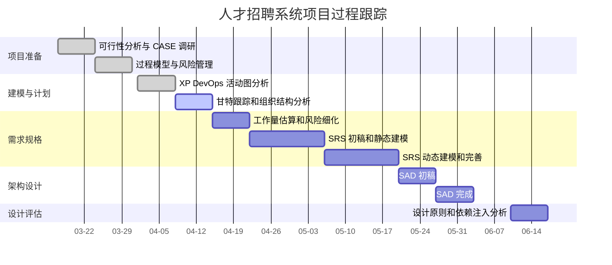

# 人才招聘系统项目跟踪工具练习

## 1. 跟踪工具选择

本项目采用轻量组合进行项目跟踪：

| 工具 | 用途 |
|---|---|
| GitHub Projects | 任务看板、状态流转、优先级管理 |
| Markdown 表格 | 保存课程报告中的进度记录 |
| Mermaid Gantt | 在 Markdown 中表达甘特图 |
| Git | 记录每个实验成果的提交历史 |

## 2. 项目甘特图

## 3. 看板字段设计

| 字段 | 类型 | 示例 |
|---|---|---|
| Status | 单选 | Todo / In Progress / Review / Done |
| Priority | 单选 | High / Medium / Low |
| Type | 单选 | Document / Code / Test / Research / Management |
| Experiment | 文本 | Experiment 05 |
| Owner Role | 文本 | 项目负责人、需求负责人、开发负责人、测试负责人 |
| Due | 日期 | 2026-04-12 |

## 4. 任务跟踪表

| 编号 | 任务 | 类型 | 优先级 | 负责人角色 | 状态 | 产出 |
|---|---|---|---|---|---|---|
| E05-01 | 提取并分析实验五活动图 | Management | High | 项目负责人 | Done | 活动时间分析表 |
| E05-02 | 计算最早/最晚时间和时差 | Management | High | 项目负责人 | Done | `活动时间分析.md` |
| E05-03 | 找出关键路径和项目总长度 | Management | High | 项目负责人 | Done | 关键路径结论 |
| E05-04 | 建立项目甘特图 | Management | Medium | 项目负责人 | Done | Mermaid Gantt |
| E05-05 | 调研团队组织结构 | Research | Medium | 文档负责人 | Done | `团队组织.md` |
| E05-06 | 分析工作方式和团队管理 | Document | Medium | 文档负责人 | Done | 实验五报告 |
| E06-01 | COCOMO II 工作量估算 | Management | High | 项目负责人 | Todo | 实验六报告 |
| E06-02 | 风险管理进一步细化 | Management | High | 项目负责人 | Todo | 风险分级表 |
| E07-01 | SRS 初稿 | Document | High | 需求负责人 | Todo | SRS 大纲 |
| E08-01 | SRS 动态模型补充 | Document | High | 设计负责人 | Todo | 状态图/Petri 网/DFD |

## 5. 每周更新记录

| 周次 | 完成内容 | 风险/问题 | 下一步 |
|---|---|---|---|
| 第 1 周 | 完成可行性分析和 CASE 调研 | 项目范围需要收敛 | 进入过程模型和 Scrum 分析 |
| 第 2 周 | 完成过程模型、Scrum、风险登记册 | 风险较多，需要持续跟踪 | 进入 XP、DevOps 和活动图 |
| 第 3 周 | 完成 XP、DevOps、活动网络和关键路径 | 活动图计算需保持一致 | 进入项目跟踪和团队组织分析 |
| 第 4 周 | 完成实验五活动图时间分析、甘特图和组织结构分析 | 后续 SRS 工作量较大 | 进入实验六工作量估算和风险管理 |

## 6. 跟踪结论

项目跟踪不能只记录“完成/未完成”，还应记录任务依赖、负责人角色、优先级、风险和产出位置。对本项目而言，Markdown 表格足够支撑课程文档，GitHub Projects 可用于后续可视化看板，Mermaid Gantt 可以直接嵌入报告，三者组合成本低、可追溯性好。
