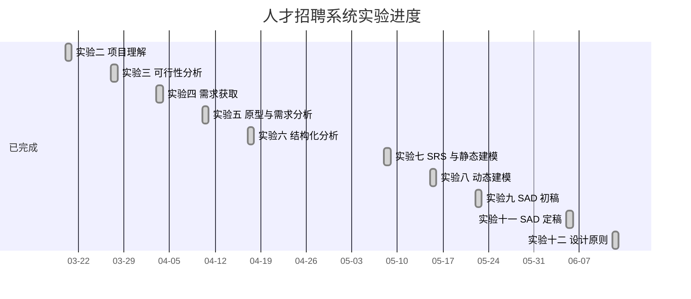

# 实验十二项目跟踪表

## 1. 本次实验任务跟踪

| 编号 | 任务 | 工作量 | 状态 | 输出物 |
|---|---|---|---|---|
| T12-01 | 提取实验十二要求 | 0.5h | 已完成 | 实验要求摘要 |
| T12-02 | 梳理当前模块设计 | 1h | 已完成 | `模块设计评估.md` |
| T12-03 | 学习并整理依赖注入 | 1h | 已完成 | `依赖注入学习笔记.md` |
| T12-04 | 分析面向对象设计原则 | 2h | 已完成 | `设计原则分析.md` |
| T12-05 | 形成重构建议 | 1h | 已完成 | `重构建议.md` |
| T12-06 | 编写实验十二报告 | 1h | 已完成 | `实验十二报告.md` |
| T12-07 | 更新项目跟踪表 | 0.5h | 已完成 | `项目跟踪表.md` |

## 2. 项目阶段总览

| 实验 | 主题 | 状态 | 主要产出 |
|---|---|---|---|
| 实验二 | 项目理解 | 已完成 | 系统理解、运行记录 |
| 实验三 | 可行性分析 | 已完成 | 可行性研究报告 |
| 实验四 | 需求获取 | 已完成 | 用户场景、用例和需求整理 |
| 实验五 | 原型与需求分析 | 已完成 | 原型说明、需求分析 |
| 实验六 | 结构化分析 | 已完成 | DFD、数据字典、加工说明 |
| 实验七 | SRS 与静态建模 | 已完成 | SRS 初稿、静态模型 |
| 实验八 | 动态建模与 Petri 网 | 已完成 | 动态模型、Petri 网模型 |
| 实验九 | SAD 初稿与 SRS 定稿 | 已完成 | SAD 初稿、架构视图、SRS 定稿 |
| 实验十一 | SAD 定稿与架构评估 | 已完成 | SAD 定稿、架构评估、改进计划 |
| 实验十二 | 设计原则与依赖注入 | 已完成 | 设计原则分析、DI 学习笔记、模块评估 |

## 3. 设计质量跟踪

| 质量项 | 当前状态 | 后续动作 |
|---|---|---|
| 职责划分 | 基本清晰，但窗口和服务类偏大 | 后续拆分工作台面板和仓储层。 |
| 依赖管理 | 已使用构造函数注入服务对象 | 后续引入服务接口和仓储接口。 |
| 可测试性 | 业务规则集中在服务层 | 后续补充服务层测试。 |
| 可扩展性 | 具备三层架构基础 | 后续迁移 SQLite 并拆分服务。 |
| 安全性 | 有角色隔离和审核准入 | 后续增加密码哈希和操作日志。 |

## 4. 风险跟踪

| 风险 | 状态 | 应对 |
|---|---|---|
| `DashboardWindow` 类体积继续增大 | 已识别 | 拆分角色面板。 |
| `RecruitmentService` 职责集中 | 已识别 | 抽取仓储层和领域服务。 |
| 测试不足影响重构 | 已识别 | 重构前先补服务层测试。 |
| 文本文件存储能力有限 | 已识别 | 后续迁移 SQLite。 |
| 密码明文存储 | 已识别 | 后续实现密码哈希。 |

## 5. 里程碑状态

## 6. 最终状态

实验十二完成后，压缩包中包含的实验二、三、四、五、六、七、八、九、十一、十二均已形成对应成果目录。后续若继续完善代码，可优先按 `重构建议.md` 中的顺序推进。
