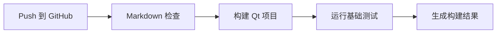

# 人才招聘系统轻量 DevOps 实施方案

## 1. 实施目标

人才招聘系统是课程级桌面项目，不需要完整企业级 DevOps 平台。本方案目标是在不增加过重成本的前提下，引入 DevOps 的协作、自动化、持续反馈和受控交付思想。

## 2. 当前基础

| 能力 | 当前状态 |
|---|---|
| 版本控制 | 已使用 Git 和 GitHub 仓库 |
| 构建脚本 | `Qt图形界面/` 下已有批处理构建脚本 |
| 文档管理 | 实验文档保存在 `软件工程实验成果/` |
| 交付流程 | 每个实验先审阅，通过后提交并推送 |
| 数据样例 | 存在 `招聘数据.txt` 等本地数据文件 |

## 3. DevOps 7C 对应措施

| 7C | 含义 | 本项目措施 |
|---|---|---|
| Communication | 沟通 | 每个实验完成后先审阅，确认后推送。 |
| Collaboration | 协作 | 使用 GitHub 仓库保存代码、文档和进度表。 |
| Controlled Process | 受控流程 | 采用“完成 -> 审阅 -> 提交 -> 推送”的固定流程。 |
| Continuous Integration | 持续集成 | 后续可在每次提交后自动检查 Markdown 和构建脚本。 |
| Continuous Deployment | 持续部署 | 桌面项目不自动部署到生产环境，但可自动生成可运行包。 |
| Continuous Testing | 持续测试 | 建立登录、注册、审核、岗位、留言等回归测试清单。 |
| Continuous Monitoring | 持续监控 | 课程项目以构建结果、测试记录、Issue 和风险表代替生产监控。 |

## 4. 建议流水线

当前阶段可以采用手工流水线：

后续可升级为 GitHub Actions：

## 5. 持续测试清单

| 测试编号 | 测试场景 | 预期结果 |
|---|---|---|
| T01 | 个人用户注册 | 注册成功后状态为待审核 |
| T02 | 企业用户注册 | 注册成功后状态为待审核 |
| T03 | 重复用户名注册 | 系统拒绝并给出错误提示 |
| T04 | 管理员审核个人用户 | 状态变为通过或拒绝 |
| T05 | 管理员审核企业用户 | 状态变为通过或拒绝 |
| T06 | 个人用户申请岗位 | 申请记录保存，不允许重复申请 |
| T07 | 个人用户撤销申请 | 申请记录被移除 |
| T08 | 企业用户发布岗位 | 岗位出现在可见岗位列表 |
| T09 | 企业用户下架岗位 | 岗位不再对个人用户可见 |
| T10 | 用户留言 | 管理员留言列表出现新留言 |
| T11 | 管理员回复留言 | 留言标记为已处理并保存回复 |
| T12 | 数据保存和重启加载 | 重启后关键数据仍存在 |

## 6. 配置管理建议

1. 保留 Qt 和 MinGW 版本说明。
2. 构建脚本中减少硬编码路径，必要时集中定义路径变量。
3. 样例数据使用模拟姓名和企业，避免真实个人信息。
4. `deliverables/` 保持忽略状态，不纳入仓库。
5. 文档和代码分目录保存，实验目录按编号递增。

## 7. 度量指标

| 指标 | 说明 |
|---|---|
| 构建成功率 | 本地或 CI 构建是否成功 |
| 回归测试通过数 | 主流程测试通过的数量 |
| 未关闭风险数 | 风险登记册中仍需跟踪的风险 |
| 文档完成度 | 每个实验要求是否有对应产物 |
| 提交频率 | 每个实验完成后是否有清晰提交 |

## 8. 结论

本项目应采用轻量 DevOps，而不是引入复杂平台。现阶段最重要的是保持版本可追溯、构建可复现、测试有清单、提交有审阅。后续如果需要提升自动化程度，可以优先增加 GitHub Actions 的 Markdown 检查和 Qt 构建检查。
