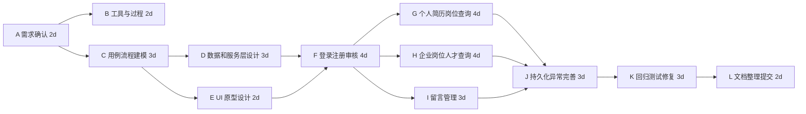

# 实验四：XP 开发方法、DevOps、活动图

## 1. 实验目的与完成情况

### 1.1 实验目的

1. 了解 XP（Extreme Programming，极限编程）开发方法。
2. 阅读 DevOps 文档，理解 DevOps 的目标、原则和实践。
3. 理解项目活动图和关键路径分析方法。
4. 针对人才招聘系统进行工作活动分解、进度估算、活动图绘制和关键路径识别。

### 1.2 本次完成内容

本次实验完成以下成果：

1. 总结 XP 的核心价值、工程实践和在项目中的应用方式。
2. 阅读 `devops.pdf`，归纳 DevOps 的协作、自动化、持续交付、监控和反馈思想。
3. 说明活动图和关键路径的计算方法。
4. 建立人才招聘系统项目活动网络，计算最早开始时间、最晚开始时间、时差和关键路径。
5. 提出适合当前 Qt 桌面项目的轻量 DevOps 实施方案。

## 2. XP 开发方法理解

### 2.1 XP 概念

XP 是一种敏捷开发方法，强调通过高频反馈、持续测试、简洁设计和持续重构来快速交付高质量软件。XP 更关注工程实践层面的执行，而不仅是项目管理框架。

### 2.2 XP 核心价值

| 核心价值 | 含义 | 对本项目的启发 |
|---|---|---|
| 沟通 | 开发者、用户和团队成员保持持续沟通 | 每完成一个实验先审阅，再提交推送。 |
| 简单 | 只实现当前真正需要的功能 | 优先实现注册、审核、岗位、申请、留言主流程。 |
| 反馈 | 通过测试、审阅和运行结果及时发现问题 | 每个实验作为一次反馈点。 |
| 勇气 | 发现设计问题时及时调整 | 当界面逻辑复杂时重构到服务层。 |
| 尊重 | 尊重角色分工和项目约束 | 文档、代码、测试各自保持清晰责任。 |

### 2.3 XP 典型实践

| 实践 | 说明 | 人才招聘系统中的应用 |
|---|---|---|
| 小版本发布 | 频繁交付可运行增量 | 每个 Sprint 完成一条业务链路。 |
| 测试驱动/测试优先 | 在实现前明确测试目标 | 为登录、注册、审核、岗位申请建立回归清单。 |
| 持续集成 | 频繁集成并保持可构建 | 每次提交前检查 Git 状态和文档格式，必要时构建 Qt 程序。 |
| 重构 | 在不改变外部行为的前提下改善结构 | 将重复业务规则放入 `RecruitmentService`。 |
| 简单设计 | 避免过度设计 | 当前阶段继续使用本地文件，数据库升级作为后续优化。 |
| 代码集体所有 | 团队都能理解和维护核心代码 | 文档中说明模块职责和数据结构。 |

### 2.4 XP 对本项目的适配

人才招聘系统适合吸收 XP 的工程实践，但不需要完整照搬 XP 的所有活动。原因如下：

1. 项目规模较小，完整结对编程和严格 TDD 成本偏高。
2. 当前目标是课程交付，需要兼顾文档、模型和代码。
3. XP 的小版本发布、回归测试、重构和简单设计非常适合控制项目风险。

因此，本项目采用“Scrum 管理节奏 + XP 工程实践”的方式推进。

## 3. DevOps 理解

### 3.1 DevOps 概念

DevOps 由 Development 和 Operations 组合而来，强调开发、测试、运维和业务之间的沟通、协作和集成。其目标是更快速、更可靠地交付软件价值。

压缩包中的 `devops.pdf` 强调：

1. DevOps 是一种协作开发和部署软件的方式。
2. DevOps 关注开发团队追求变化与运维团队追求稳定之间的矛盾。
3. DevOps 通过文化、自动化、精益、度量和共享来提升交付能力。
4. DevOps 实践包括持续集成、持续部署、持续测试、持续监控和配置管理。
5. 7C 思路包括 Communication、Collaboration、Controlled Process、Continuous Integration、Continuous Deployment、Continuous Testing、Continuous Monitoring。

### 3.2 DevOps 与传统开发运维的差异

| 维度 | 传统方式 | DevOps 方式 |
|---|---|---|
| 团队关系 | 开发、测试、运维分离 | 跨角色协作，共同关注交付价值 |
| 发布方式 | 手工发布，周期长 | 自动化构建、测试和部署 |
| 质量控制 | 后期集中测试 | 持续测试、持续反馈 |
| 环境管理 | 开发和运行环境容易不一致 | 通过配置管理和自动化减少差异 |
| 问题处理 | 出问题后追责 | 复盘、改进流程和工具 |
| 度量 | 依赖人工汇报 | 使用构建、测试、缺陷和运行指标 |

### 3.3 DevOps 对当前项目的意义

人才招聘系统是桌面课程项目，不需要完整企业级 DevOps 平台，但可以采用轻量 DevOps 思想：

1. 使用 Git 和 GitHub 管理代码与文档。
2. 保留构建脚本，减少环境差异。
3. 建立回归测试清单，降低演示失败风险。
4. 每次实验先审阅后推送，形成受控流程。
5. 后续可添加 GitHub Actions，自动检查 Markdown、构建或运行基础测试。

## 4. 活动图和关键路径方法

### 4.1 活动图含义

项目活动图用于表达项目任务及其先后依赖关系。活动可以看作边或节点，边长或任务持续时间代表工期。通过活动图可以识别项目总工期、并行活动和关键路径。

### 4.2 关键路径计算方法

关键路径分析通常包括以下步骤：

1. 列出所有活动、持续时间和前置活动。
2. 正向计算最早开始时间 ES 和最早完成时间 EF。
3. 反向计算最晚开始时间 LS 和最晚完成时间 LF。
4. 计算时差 Slack：`Slack = LS - ES`。
5. 时差为 0 的活动构成关键路径。
6. 关键路径长度就是项目最短总工期。

### 4.3 活动图练习安排

本次活动图练习以人才招聘系统为对象，先列出项目活动、工期和依赖关系，再进行正向计算、反向计算、时差计算和关键路径识别。详细计算过程见 `活动网络图.md`。

## 5. 人才招聘系统项目活动分解

### 5.1 活动列表

| 编号 | 活动 | 工期（天） | 前置活动 |
|---|---|---:|---|
| A | 需求确认与范围冻结 | 2 | 无 |
| B | CASE 工具调研与过程方案 | 2 | A |
| C | 用例和业务流程建模 | 3 | A |
| D | 数据结构和服务层设计 | 3 | C |
| E | UI 原型和界面结构设计 | 2 | C |
| F | 登录注册与审核功能 | 4 | D, E |
| G | 个人简历与岗位查询功能 | 4 | F |
| H | 企业岗位管理和人才查询功能 | 4 | F |
| I | 留言和管理员处理功能 | 3 | F |
| J | 数据持久化和异常处理完善 | 3 | G, H, I |
| K | 回归测试和缺陷修复 | 3 | J |
| L | 文档整理和提交 | 2 | K |

### 5.2 活动网络图

### 5.3 关键路径结论

根据 `活动网络图.md` 中的正向和反向计算：

关键路径为：

`A -> C -> D -> F -> G/H -> J -> K -> L`

其中 `G` 和 `H` 两条分支工期相同，都可能位于关键路径上。因此项目存在两条等长关键路径：

1. `A -> C -> D -> F -> G -> J -> K -> L`
2. `A -> C -> D -> F -> H -> J -> K -> L`

项目最短总工期为 24 天。

## 6. 项目进度安排

| 阶段 | 活动 | 计划工期 | 输出 |
|---|---|---:|---|
| 需求与准备 | A, B, C | 7 天 | 可行性、CASE 调研、过程模型、用例流程 |
| 设计 | D, E | 3 天（并行后取最大） | 数据结构、服务层接口、UI 原型 |
| 核心开发 | F, G, H, I | 8 天（并行后取关键分支） | 注册审核、岗位、简历、留言 |
| 完善和测试 | J, K | 6 天 | 数据可靠性、异常处理、回归测试 |
| 文档提交 | L | 2 天 | 实验报告、模型和提交记录 |

## 7. 本次实验结论

通过本次实验，项目过程进一步细化到工程实践和进度控制层面。XP 的小版本发布、持续测试、重构和简单设计可以弥补 Scrum 偏管理框架的不足；DevOps 的协作、自动化、持续集成和监控思想可以帮助项目降低构建、测试和交付风险。

活动网络分析表明，人才招聘系统当前关键路径主要经过需求建模、数据和服务层设计、登录注册审核、个人/企业主流程、持久化完善、回归测试和文档提交。后续管理中应重点关注关键路径任务，避免核心功能延期。

## 8. 参考资料

1. 《devops.pdf》，压缩包参考资料。
2. 《实验内容四.docx》，压缩包实验要求。
3. Kent Beck, Extreme Programming Explained: Embrace Change.
4. Atlassian Agile Coach, DevOps and CI/CD: <https://www.atlassian.com/devops>
